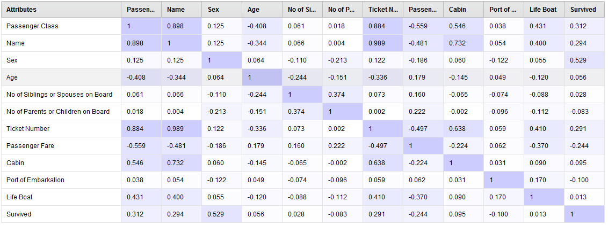

## Übersicht Data Mining Algorithmen 

Die Datamining Algorithmen lassen sich grob in vier Kategorien untergliedern (vgl. Runkler S. 3):

- Klassifikation
- Clusteranalyse
- Korellationsanalyse
- Regressionsanalyse

### Klassifikation
Klassifkation setzt man grundsätzlich ein, wenn man einen gelabelten Datensatz zur Verfügung hat. Gelabelt heißt in diesem Kontext, dass jedem Tupel eine Klasse zugeordnet wurde und das Modell anhand dieser Information trainieren kann. In der englischsprachigen Literatur ist dies unter supervised learning bekannt.
Die Klassifikation bietet den großen Vorteil, dass eine Überprüfung des Algorithmus anhand der gelabelten Testdaten stattfinden kann. Hierfür wird der Quelldatensatz aufgeteilt; zum einen in einen Lerndatensatz für das Training des Modells und zum anderen in einen Testdatensatz für die spätere Evalueriung des Algorithmus.

Einige bekannte Algorithmen:
(teilweise entnommen aus Tan)

- Naive Bayes
- Decision Tree
- Decision Forest
- Rule-Based
- Support vector machine 
- Neural network

Die Algorithmen Naive Bayes, Decisiontree und Support Vector Machine sind in den folgenden Kapiteln detailliert beschrieben.
In unserem Softwareprojekt der Twitter-Text-Analyse ist ein gelabelter Datensatz vorhanden, sodass das Projektteam die Klassifikation mit den drei genannten Algorithmen vornehmen kann.

### Clusteranalyse
Die Clusteranalyse ist ein unsupervised learner. Beim unsupervised learning besitzen die Quelldaten kein Label.
In den Quelldaten werden Ähnlichkeiten und Muster zwischen den Tupeln gesucht und die Tupel in Cluster aufgeteilt. Die Tupel sollen in ihrem Cluster möglichst ähnlich sein und verschieden zu den Tupeln in den anderen Clustern. Somit ist auch eine Evaluierung möglich: denn ein gutes Clustering hat eine hohe Separation zwischen den einzelnen Clustern.
(vgl. Cichosz S. 15) 

Eine Beispielvisualisierung mit den Attributen *debt* und *income*.

Entnommen aus <https://www.analyticsvidhya.com/wp-content/uploads/2013/11/Clust1.gif>.

Einige bekannte Algorithmen:

- k-means
- k-medoids
- fuzzy c-Mean

### Korrelationsanalyse
Die Korrelationsanalyse untersucht die Korrelation (Abhängigkeit) zwischen den Attributen über alle Daten. Die Stärke wird durch den Korrelationskoeffizienten ausgedrückt. 
Das Ergebnis der Korrelationsanalyse ist meistens eine Korrelationsmatrix, welche alle Korrelationskoeffizienten der Attribute zueinander enthält.

Diese Korrelationsmatrix wurde mithilfe von Rapidminer erstellt und zeigt die Koeffizienten des "Titanic-Datensatzes". 
Der Datensatz ist zu finden unter <https://www.kaggle.com/c/titanic/data>.
Auffällig ist die Korrelation zwischen "Sex" und "Survived".

### Regressionsanalyse
Die Regressionsanalyse lässt sich am ehesten mit der Klassifizierung vergleichen. Doch hier wird keine diskrete Klasse vorhergesagt, sondern ein nummerischer Wert. Dieser Wert wird durch die Regression bestimmt. 
(vgl. Cichosz S. 14)

### Quellen

* Thomas A. Runkler: Data Mining - Modelle und Algorithmen intelligenter Datenanalyse; 2. Auflage; Springer; 2015
* Tan, Steinbach, Kumar: Data Mining - Classification: Basic Concepts, Decision Trees, and Model Evaluation; 2004; <https://www-users.cs.umn.edu/~kumar/dmbook/dmslides/chap4_basic_classification.pdf> Aufgerufen am 01.07.2017.
* Pawet Cichosz: Data Mining Algorithms - Explained Using R; Wiley; 2015; <http://pdf.th7.cn/down/files/1502/Data%20Mining%20Algorithms.pdf> Aufgerufen am 01.07.2017.
