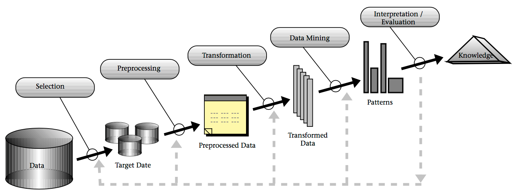

## Knowledge Discovery in Databases (KDD)
Das Volumen der jährlich generierten digitalen Datenmenge ist in den letzten Jahren massiv angewachsen. Doch nur eine geringe Menge dieser Daten wird für Analysen genutzt.[[5]](#fn5)
*Knowledge Discovery in Databases* beschreibt das generelle Vorgehen, um genau diese Daten zu nutzen, dass heißt Wissen zu generieren.

### Definition
Der Begriff *Knowledge Discovery in Databases* wird in der Literatur unterschiedlich verwendet. Es kommt vor, dass es als Synonym zu dem Begriff *Data Mining* genutzt.[[4]](#fn4) Üblicherweise beschreibt *Knowledge Discovery in Databases* aber einen Prozess in dem *Data Mining* lediglich einen Teilschritt darstellt.[[2]](#fn2)

Das *Gabler Wirtschaftslexikon* definiert KDD wie folgt:
>Knowledge-Discovery-in-Databases (KDD)-Prozess; umfassender Datenanalyseprozess, in dessen Kern Verfahren des Data Mining zur Anwendung kommen. Der-Knowledge-Discovery-in-Databases (KDD)-Prozess umfasst folgende Phasen:[...] [[3]](#fn3)

Hung (2009) beschreibt KDD als einen
> [...] nichttrivialer mehrstufiger Prozess der Wissensfindung aus vorhandenen Informationen. KDD-Prozess umfasst alle Schritte, von woher die Daten abgeholt werden, über Vorverarbeitung und eigentliche Verarbeitung zur Informationsgewinnung (Data-Mining-Schritt), bis hin wie die Endinformation interpretiert und dargestellt wird. [[2]](#fn2)

### KKD-Prozess
Fayyad et al. beschrieben 1996 erstmals die einzelnen Schritte, die bei der *Knowledge Discovery in Databases* genutzt werden. Dazu entwickelten sie ein Model, welches heuzutage oft unter den Begriffen "KDD Prozess" oder "Schritte des KDD" zu finden sind.

Nach Fayyad et al. besteht KDD aus den folgenden neun Schritten:[[1]](#fn1)

1. Problemabgrenzung
2. Auswahl der Daten
3. Datenvorverarbeitung
4. Datenreduktion und Kodierung
5. Auswahl der Data Mining Methode
6. Auswahl des Data Mining Algorithmus
7. Data Mining
8. Interpretation der Ergebnisse
9. Anwendung des gefundenen Wissens

Das *Fayyad Modell des KDD Prozesses* ist in Abbildung [1](#fig:kddprocess) dargestellt. Es handelt sich im ein iteratives Modell, dass bedeutet, die Schritte können mehrfach durchlaufen werden. Nach der Evaluation der Ergebnisse müssen eventuell einige Schritte neu durchlaufen werden, um das Ergebnisse in der Evaluation zu verbessern. So kann es beispielsweise sein, dass in der Evaluation auffällt, dass bei der Vorverarbeitung nicht alle unerwünschten Daten herrausgefiltert wurden.[[1]](#fn1)[[2]](#fn2)

*<a name="fig:kddprocess">Abbildung 1: </a>Fayyad Modell des KDD Prozesses*[[1]](#fn1)

#### Die Schritte im Detail
__1. Problemabgrenzung:__
Im ersten Schritt muss zunächst das Ziel aus der Sicht des Kunden identifiziert werden. Außerdem ist es wichtig sich mit dem jeweiligen Fachbereich vertraut zu machen.[[1]](#fn1)

__2. Auswahl der Daten:__
Im zweiten Schritt wird ein Datensatz ausgewählt. Das Ziel aus Schritt eins sollte dabei beachtet werden, denn das erreichen des Zieles hängt von der Qualität des Datensatzes ab.[[1]](#fn1)

__3. Datenvorverarbeitung:__
Im dritten Schritt werden die Daten vorverarbeitet. Unnerwünscht informationen, die die Ergebnisse des Data Minings negativ beeinflussen würden, sollten herrausgefiltert werden. In diesem Schritt sollte auch entschieden werden, wie mit fehlenden/unvolständigen Datenfeldern umgegangen wird.[[1]](#fn1)

__4. Datenreduktion und Kodierung:__
Im vierten Schritt werden die Daten in eine andere Form gebacht, damit Data Mining Algorithmen sie verstehen und verarbeiten können. Dieses Verfahren wird oft auch "Kodierung", "Datenprojektion" oder "Datentransformation" genannt. Bei der Datentranformation wird i.d.R. auch eine Datenreduktion durchgeführt, bei der Daten mit geringer Aussagekraft entfernt werden. [[1]](#fn1)

__5. Auswahl der Data Mining Methode:__
Im fünften Schritt wird mit Hilfe des Ziels aus Schritt 1 eine bestimmte Data Mining Methode ausgewählt.
Bekannte Methoden sind beispielweise die Klassifikation oder die Clusteranalyse.[[1]](#fn1)

__6. Auswahl des Data Mining Algorithmus:__
Im sechsten Schritt wird innerhalb der zuvor gewählten Data Mining Methode ein Algorithmus ausgewählt. Zudem wird entschieden mit welchen Parametern dieser Algorithmus am besten aufgerufen wird.[[1]](#fn1)

__7. Data Mining:__
Der siebte Schritt ist das eigendliche Data Mining.[[1]](#fn1)

__8. Interpretation der Ergebnisse:__
Im achten Schritt werden die Ergebnisse des Data Mindings interpretiert. Dies kann auch eine Visualizierung umfassen.[[1]](#fn1)

__9. Anwendung des gefundenen Wissens:__
Im neunten Schritt werden die Ergebnisse angewendet. Das bedeutet beispielsweise das Wissen in ein anderes System weiter zu geben, oder auch einfach eine Dokumentation der Ergebnisse anzufertigen.
Weiter sollte auf Konflikte zu dem bisherigen Wissensstand geprüft werden.[[1]](#fn1)

### Einordnung dieses Projektes in den KDD Prozess
Dieses Projekt "Twitter-Miner" durchläuft alle Schritte des KDD Prozesses. In diesem Kapitel soll ein kurzer Überblick gegeben werden, was in diesem Projekt in den jeweiligen Schritten gemacht wurde und wo weitere Informationen zu finden sind.

__1. Problemabgrenzung:__ 
Die Problemabgrenzung und Definition des Ziels wurde u.a. im Pflichtenheft festgelegt. Ziel ist die Stimmungsanalsyse von Tweets (=Sentiment Analysis).

__2. Auswahl der Daten:__
Die Datenbasis dieses Projektes bilden Tweets. Zu einem bestimmten Hastag werden über eine Schnittstelle Tweets geladen.

__3. Datenvorverarbeitung:__
Tweets können viele unerwünschte Informationen enthalten wie beispielweise Links, die in diesem Schritt entfernt werden. Weiteres zum Thema Datenvorverarbeitung ist [hier](https://github.com/YKloss/Twitter_Miner/blob/master/Ausarbeitung/Einleitung/Datenvorverarbeitung.md) zu finden.

__4. Datenreduktion und Kodierung:__
Um die Tweets als Eingabe für unsere Data-Mining-Algorithmen zu nutzen wurden sie in entsprechende Zahlenrepräsentationen umgewandelt. Innerhalb dieses Projektes wurden dafür sogenannte *tf-idf Vektoren* genutzt. Dieses Thema wird ebenfalls in [diesem Kapitel](https://github.com/YKloss/Twitter_Miner/blob/master/Ausarbeitung/Einleitung/Datenvorverarbeitung.md) beschrieben.

__5. Auswahl der Data Mining Methode:__
Das Ziel aus Schritt 1 (Sentimentanalyse) lässt sich mit der Data Mining Methode "Klassifikation" erreichen. Kassifikationsalgorithmen können bestimmen, ob ein Merkmal zu einer bestimmten Klasse gehört oder nicht. Das heißt bei der Sentimentanalyse gibt der Klassifikationsalgorithmus aus, ob es sich um einen positiven Tweet oder einen negativen Tweet handelt.

Eine generelle Übersicht der Data Mining Methoden ist [hier](https://github.com/YKloss/Twitter_Miner/blob/master/Ausarbeitung/Einleitung/Uebersicht_Data_Mining_Algorithmen.md) aufgelistet.

__6. Auswahl des Data Mining Algorithmus:__
Innerhalb dieses Projektes werden die drei folgenden Klassifikationsalgorithmen genutzt.
* [Bayes](../bayes.md)
* [Support Vector Machine](../support-vector-machine.md)
* [Decision Tree](../decision-tree.md)

__7. Data Mining:__
In diesem Schritt wird ein Datensatz auf mehrere Tweets mit den Algoritmen aus Schritt 6 klassifiziert.

__8. Interpretation der Ergebnisse:__
Die Ausgabe der Algorithmen wird in diesem Schritt interpretiert. Ist die Ausgabe beispielweise [0,1], so ist der entsprechende Tweet positiv, ist die Ausgabe [1,0], so ist er negativ.

__9. Anwendung des gefundenen Wissens:__
Die Anwendung des gefundenen Wissens erfolgt in einer Präsentation durch eine Weboberfläche.

___

<b id="fn1"></b>1. Fayyad, U., Piatetsky-Shapiro, G., & Smyth, P. (1996). From Data Mining to Knowledge Discovery in Databases. AI Magazine, 17(3), 37. [↩](#fn1_1)[↩](#fn1_2)[↩](#fn1_3)

<b id="fn2"></b>2. Hung, P. T. (2009). Data-Mining und Knowledge Discovery in Databases (KDD) Ein Überblick. Dresden. Retrieved from https://www.inf.tu-dresden.de/content/institutes/iai/tis-neu/lehre/archiv/folien.ws_2008/Vortrag_Hung.pdf [↩](#fn2_1)[↩](#fn2_2)[↩](#fn2_3)

<b id="fn3"></b>3. Springer Gabler Verlag (Herausgeber), Gabler Wirtschaftslexikon, Stichwort: Knowledge Discovery in Databases (KDD), online im Internet: 
http://wirtschaftslexikon.gabler.de/Archiv/75635/knowledge-discovery-in-databases-v10.html [↩](#fn3_1)

<b id="fn4"></b>4. Alpaydın, E. (2014). Introduction to machine learning. Methods in Molecular Biology (Second Edi, Vol. 1107). The MIT Press.[↩](#fn4_1)

<b id="fn5"></b>5. Gantz, John und David Reinsel (2012). IDC IVIEW: THE DIGITAL UNIVERSE IN 2020: Big Data, Bigger Digital Shadows, and Biggest Growth in the Far East. Techn. Ber. URL: http://www.emc.com/collateral/analyst-reports/idc-the-digital-universe-in-2020.pdf [↩](#fn5_1)
