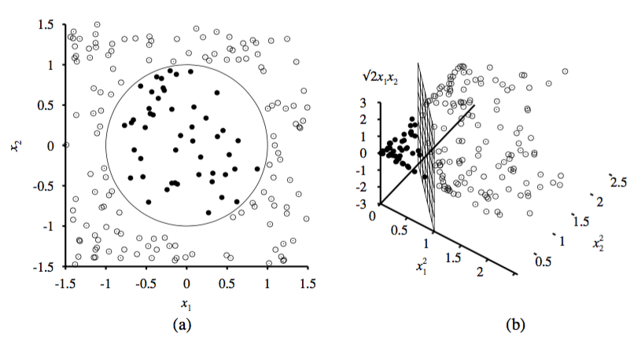

# Algorithmus im Detail

*<a name="fig:svm2">Abbildung 1: </a>Zwei mögliche Hyperebenen*[[1]](#fn1)

Eine Support Vector Machine trennt eine Menge von Objekten mit einer Hyperebene in zwei Klassen, sodass der Abstand zwischen den Objekten der Klassen und der Hyperebene maximal wird. Sie wird daher auch als *Large Margin Classifier* bezeichnet. Abbildung [1](#fig:svm2) zeigt eine Menge von Objekten, die zu zwei verschiedenen Klassen gehören, sowie zwei mögliche Hyperebenen *A* und *B*. Beide teilen die Objekte in zwei Klassen auf, doch der Abstand bei Trennebene *A* ist wesentlich größer als bei Trennebene *B*. Die Trennebene *A*, mit dem maximalen Abstand, stellt damit einen besseren Klassifikator dar, weil sie den kleinsten Generalisierungsfehler erzeugt.[[2]](#fn2)

#### Ebenendarstellung

Gegeben sei ein zweidimensionaler Raum, dann lässt sich die Hyperebene als lineare Gleichung  darstellen. Sei Vektor   und  ,
dann lässt sich die lineare Gleichung darstellen als  .[[3]](#fn3)

#### Bedingungen

Gesucht werden zwei Hyperebenen  und , die eine Menge von Datenpunkten in zwei verschiedene Klassen trennen. Zwischen diesen Hyperebenen sollen sich keine Datenpunkte befinden.
Für jeden Datenpunkt  muss also gelten:

<a name="eq:constraint1">Formel 1: </a> 

oder

<a name="eq:constraint2">Formel 2: </a> 

Sei  ist die zugehörige Klasse zum Datenpunkt , dann lassen sich die Bedingungen aus Formal [1](#eq:constraint1) und [2](#eq:constraint2) zu einer einzigen Bedingung zusammenfassen, indem sie mit  multipliziert werden.

<a name="eq:constraint3">Formel 3: </a> &space;\geq&space;1\;\text{f\"ur}&space;1\leq&space;i&space;\leq&space;n)

In Abbildung [2](#fig:svm1) markieren die gestrichelten Linien zwei mögliche Hyperebenen, sodass die Bedingung aus Formel [3](#eq:constraint3) erfüllt ist.[[4]](#fn4)

*<a name="fig:svm1">Abbildung 2: </a>Support Vector Machine - Hyperebene mit maximalem Abstand*[[1]](#fn1)

#### Abstandsberechnung

Ziel der Support Vector Machine ist es den Abstand  zwischen den Hyperebenen  und  zu maximieren.

*<a name="fig:svmmargin">Abbildung 3: </a>Abstandsberechnung*[[4]](#fn4)

Der Abstand  lässt sich einfach als Vektor  darstellen mit:

<a name="eq:marginvector">Formel 4: </a> 

Addiert man zu einem Punkt  in der Hyperebene  den Vektor  , so erhält man den Punkt  in der Hyperebene .
Setzt man Formel [4](#eq:marginvector) in  ein, so erhält man die Formel [5](#eq:margin) um den Abstand zu berechnen.[[4]](#fn4)

<a name="eq:margin">Formel 5: </a> 

Die Herleitung der Formel [5](#eq:margin) ist [hier](herleitung-svm-abstand.md) aufgelistet.[[4]](#fn4)

#### Optimierungsproblem

Den maximalen Abstand  erhält man demnach, indem  minimiert wird.
Es wird also eine Hyperebene mit dem kleinsten  gesucht, die die Bedingung aus Formel [3](#eq:constraint3) erfüllt.

Eine Möglichkeit dieses Optimierungsproblem zu lösen ist mittels Gradientenabstieg.
Genutzt wurde dazu die Implementierung des *Pegasos*[[5]](#fn5) Algorithmus aus dem *sklearn*-Framework[[6]](#fn6). Der Algorithmus basiert auf der Fehlerfunktion aus Formel [6](#eq:svderrorfunc).
 bezieht sich hierbei auf die *hinge loss* Funktion (siehe Formel [7](#eq:hingeloss)).

<a name="eq:svderrorfunc">Formel 6: </a> &space;=&space;\lambda\frac{1}{2}&space;\left\|&space;\vec{w}&space;\right\|^2&space;&plus;&space;\frac{1}{n}&space;\sum_{i=1}^n&space;\ell_i(\langle&space;\vec{w},\vec{x}\rangle&space;&plus;&space;b))

<a name="eq:hingeloss">Formel 7: </a> }\})

#### Kernel Trick
Die Support Vector Machine, wie sie bisher besprochen wurde, kann nur Daten in zwei Klassen trennen, wenn sie linear separierbar sind. Das wird erreicht, indem eine Hyperebene konstruiert wird. Linear separierbar bedeutet, dass es sich immer um eine gerade Ebene handeln muss. 
Im zweidimensionalen Raum ist eine Hyperebene eine Gerade. Abbildung [4](#fig:kerneltrick) stellt das Problem gut dar. Links ist eine Menge von Datenpunkten im zweidimensionalen Raum dargestellt, die zu zwei verschiedenen Klassen gehören. Diese Daten lassen sich beispielsweise mit einem Kreis in zwei Klassen trennen. Eine Support Vector Machine könnte diese Daten nicht klassifizieren, da sich die Daten nicht mit einer Gerade trennen lassen.[[7]](#fn7) 

Doch mit dem sogenannten Kernel Trick ist dies trotzdem möglich. Die Idee dabei ist, dem Merkmalsraum eine weitere Dimension hinzuzufügen. Auf dem linken Bild befinden sich die Datenpunkte im zweidimensionalen Raum. Das rechte Bild zeigt die gleichen Datenpunkte im dreidimensionalen Raum. Gut zu erkennen ist, dass sich die Daten nach der transformation linear separieren lassen. Dadurch lässt sich auch die Support Vector Machine auf dieses Problem anwenden.[[7]](#fn7) 

Die Datenpunkte lassen sich auf verschiedene Weisen in eine höhere Dimension projizieren.
In dem Beispiel aus Abbildung [4](#fig:kerneltrick) wurden die drei neuen Dimensionen wie folgt berechnet:[[7]](#fn7) 

<a name="eq:kernel">Formel 8: </a>

Ein weiterer Vorteil des Kernel Tricks ist, dass die Berechnung sehr effizient ist. Die Berechnung der Hyperebene kann in einem höherdimensionalen Raum durchgeführt werden, ohne die einzelnen Datenpunkte in diesen Raum zu projizieren.[[7]](#fn7) 

*<a name="fig:kerneltrick">Abbildung 4: </a>Kernel Trick grafisch dargestellt: (a) Daten im zweidimensionalen Raum, (b) Daten projiziert in den dreidimensionalen Raum*[[7]](#fn7)
___

<b id="fn1"></b>1. https://de.wikipedia.org/wiki/Support_Vector_Machine [↩](#fn1_1)[↩](#fn1_2)

<b id="fn2"></b>2. Manning, C. D., Raghavan, P., & Schütze, H. Cambridge University Press; 2009. Introduction to Information Retrieval [↩](#fn2_1)

<b id="fn3"></b>3. http://www.svm-tutorial.com/2014/11/svm-understanding-math-part-2/ [↩](#fn3_1)

<b id="fn4"></b>4. http://www.svm-tutorial.com/2015/06/svm-understanding-math-part-3/ [↩](#fn4_1)[↩](#fn4_2)[↩](#fn4_3)[↩](#fn4_4)

<b id="fn5"></b>5. Shalev-Shwartz, Shai, et al. "Pegasos: Primal estimated sub-gradient solver for svm." Mathematical programming 127.1 (2011): 3-30. [↩](#fn5_1)

<b id="fn6"></b>6. http://scikit-learn.org/stable/modules/sgd.html [↩](#fn6_1)

<b id="fn7"></b>7. Russell, S., & Norvig, P. (2009). Artificial Intelligence: A Modern Approach. Prentice Hall (Third edit). Pearson. [↩](#fn7_1)[↩](#fn7_2)[↩](#fn7_3)[↩](#fn7_4)[↩](#fn7_5)
