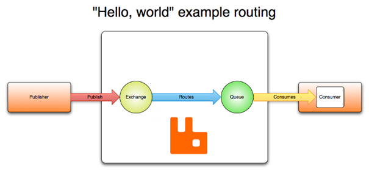

## AMQP
### Protokollübersicht
Das Advanced Message Queuing Protocol (AMQP) wurde 2010 als binäres Netzwerkprotokoll auf Anwendungsebene entwickelt [17](Quellen.md). Es deckt alle Funktionen des „Java Message Services“ (JMS) ab und erweitert diese. Außerdem ist es, anders als JMS Programmiersprachen unabhängig [18](Quellen.md). Ähnlich wie MQTT und JMS nutzt das Protokoll einen Message Broker (Server) welcher die Nachrichten der Producer an die Consumer weiterleitet. Um die Nachrichten zu transportieren, wird das TCP Protokoll verwendet. Ein Broker verwaltet intern mehrere Exchanges, welche die Nachrichten der Producer annehmen und mithilfe von definierten Regeln (routes) an eine oder mehrere Message Queues übergeben. Von hieraus können die Nachrichten entweder direkt an den Consumer übergeben werden, oder solange zwischen gespeichert werden, bis der Consumer sie abruft. Das untenstehende Bild zeigt den groben Ablauf der Kommunikation [19](Quellen.md).

### Exchanges und Routing
Das Erstellen und Konfigurieren der Routing Regeln wird von den Anwendungen selbst übernommen und muss nicht von den Administratoren des Brokers vorgenommen werden. Grundsätzlich ist der Exchange die Kommunikationsschnittstelle für den Produzenten und die Queue die Schnittstelle für den Konsumenten. Das Protokoll unterscheidet zwischen vier Routing Regeln [19](Quellen.md).
1.	Direct Exchange: ist die Standard Regel. Wenn diese gewählt ist, wird beim Erstellen einer neuen Queue direkt auch ein Exchange mit gleichem Namen erstellt. Diese Regel lässt es so aussehen, als ob Nachrichten ohne Exchange direkt auf einen Queue gesendet werden können. 
2.	Fanout Exchange: sendet Nachrichten an alle Queues, die an den Exchange gebunden sind. Wenn also 5 Queues an den Exchange gebunden sind, wird je eine Kopie der Nachricht an diese 5 Queues gesendet. Diese Art ist besonders für „Broadcast“  (Many-to-Many)Nachrichten geeignet.
3.	Topic Exchange: sendet Nachrichten zu einer oder vielen Queues. Die Queues werden durch einen „routing Key“ bestimmt. Stimmt dieser mit einem Pattern überein, das beim Erstellen der Queue übergeben wurde, erhält die Queue eine Kopie der Nachricht. 
4.	Headers Exchange: Nachrichten werden aufgrund von bestimmten im Nachrichten Header definierter Attribute weitergeleitet. Wenn eine Nachricht einen bestimmten Header aufweist, wird sie an eine bestimmte Queue geleitet.
### Queues
Queues in AMQP funktionieren ähnlich wie Queues in anderen Message Protokolls. Sie halten Nachrichten solange, bis sie vom Konsumenten abgeholt werden. Queues haben einen Eindeutigen Namen, mit welchem sie identifiziert werden. Um das Routing zu ermöglichen haben sie noch einige weitere Attribute. Um eine Queue zu nutzen, muss sie erstellt werden, hierzu sind der Name und die Routing Parameter notwendig. Sollte bei der Erstellung einer Queue schon eine mit gleichem Namen und Attributen bestehen, wird keine neue erstellt, sondern diese genutzt. Wenn die Attribute nicht übereinstimmen, wird ein Fehler zurück geliefert. [19](Quellen.md).
### Sicherheit
Aufgrund der Verwendung des TCP Protokolls, können AMQP Nachrichten und Header durch TLS/SSL abgesichert werden. Um Nachrichten Ende zu Ende zu verschlüsseln, kann die eigentliche Nachricht zusätzlich verschlüsselt werden. Dieses beeinflusst das Routing nicht, da der Nachrichten Header nicht verändert wird [20](Quellen.md)
### IoT Verwendung
AMQT eignet sich durch die vielseiten Protokolleingeschaften zwar tendenziell für den Einsatz im IoT Umfeld, da es aber eigentlich für den Einsatz im "High Performance Server" Umfeld konzipiert ist, ist es grade auf kleinen eingebetteten Geräten schwierig einzusetzen [28](Quellen.md). 
