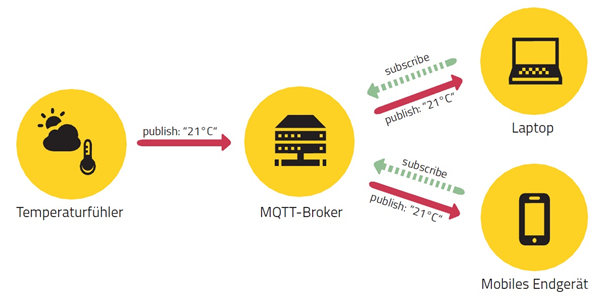
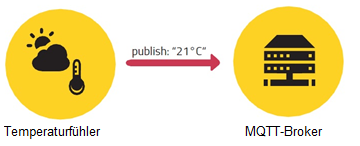
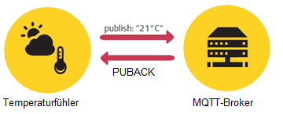
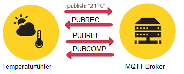

## MQTT
### Struktur & Nutzen
Das Message Queue Telemetry Transport Protokoll (MQTT) ist ein schlankes und leichtgewichtiges Kommunikationsprotokoll, dass auf dem Publish-Subscribe Prinzip basiert. Es wurde 1999 als Kommunikationsprotokoll zwischen Maschinen entwickelt. Besonders wichtig war den Entwicklern der geringe Protokoll-Overhead, sodass das Protokoll auch von Low-Energy Geräten ohne viel Prozessorzeit verarbeitet werden kann. Die „Organization for the Advancement of Structured Information Standards“ (OASIS) standardisiert seit 2013 MQTT als das Protokoll des Internets der Dinge [5](Quellen.md).
Zur Kommunikation zwischen zwei Clients ist ein Broker (Server) nötig. Beide Clients melden sich beim Broker an und teilen diesem mit, welche „Topics“ sie abonnieren möchten. Ein Topic wird mit einer Zeichenkette beschrieben und definiert den Kommunikationskanal. Der Broker sorgt dafür, dass die von Client A auf einem Topic gesendeten Daten, an alle Abonnenten dieses Topics zugestellt werden. Hierbei ist besonders zu beachten, dass auch viele Konsumenten und Produzenten das gleiche Topic Verwenden können. MQTT eignet sich deshalb besonders als „Many-to-Many“ Kommunikationsprotokoll [6](Quellen.md).  Meistens wird zum Nachrichtenaustausch MQTT über TCP übertragen. Dies ist aber nicht vorgeschrieben, sodass auch andere Protokolle genutzt werden können [4](Quellen.md). 
Das untenstehende Bild beschreibt den beschriebenen Ablauf mit einem Beispiel. Ein Temperaturfühler misst die Temperatur und sendet diesen Wert auf über ein Topic (z.B. „/temperatur“) an den Broker. Der Broker verteilt die Nachricht an alle Clients, die das bestimmte Topic abonniert haben.

Die Konsumenten und Produzenten sind aber nicht fest an ihre Rollen gebunden, sondern können auch die jeweils andere Rolle übernehmen. 
### QoS
Da MQTT nicht zwangsläufig über TCP übertragen werden muss, das unterliegende Protokoll also nicht ein erhalt einer Nachricht garantieren muss, definiert MQTT drei verschiedene Quality of Service (QoS) Klassen.

**QoS Level 0** ist die niedrigste Qualitätsstufe. Bei dieser wird nicht garantiert, dass die Nachricht überhaupt irgendwo ankommt – „fire'n'forget“ [2](Quellen.md).

**QoS Level 1** garantiert, dass die Nachricht mindestens einmal beim Ziel ankommt. Der Broker muss das Erhalten der Nachricht einmal bestätigen. Bleibt die Bestätigung aus, oder kommt erst nach Ablauf eines Timeouts beim Client an, sendet er die Nachricht erneut. Deshalb kann es bei diesem Level zu mehrfach Sendungen kommen [2](Quellen.md).
ankommt – „fire'n'forget“ [2](Quellen.md).

**QoS Level 2** garantiert, dass die Nachricht genau einmal beim Ziel ankommt. Hierzu müssen vier Nachrichten zwischen Client und Broker ausgetauscht werden. Der Broker bestätigt das erhalten der Publish-Nachricht mit einer „PUBREC“ („Publish received“) Paket. Zu diesem Zeitpunkt ist dem Client klar, dass seine Nachricht erfolgreich beim Broker angekommen ist. Das Bestätigt er wiederum mit einer „PUBREL“ („Publish release“) Paket, was der Broker wiederrum mit dem „PUBCOMP“ („Publish complete“) Paket bestätigt [2](Quellen.md).
ankommt – „fire'n'forget“ [2](Quellen.md).

Diese QoS Klasse muss an zwei Stellen definiert werden. Zum einen muss der Sender jeder seiner Nachrichten ein QoS Level mit geben um zu definieren mit welcher Garantie die Nachricht beim Broker ankommt, zum anderen muss der Abonnent eines Topics definieren mit welcher Wahrscheinlichkeit die Nachrichten bei ihm ankommen sollen. Das gewählte QoS Level hängt von vielen Faktoren ab, die Wichtigkeit der Nachricht, die Zuverlässigkeit des Transportwegs oder die Kosten einer Nachricht können in die Entscheidung einfließen [2](Quellen.md).
### Last Will
Ein Client kann beim Broker festlegen, dass eine Bestimmte Nachricht an alle Interessierten geschickt wird, sobald der Broker merkt, dass der entsprechende Client die Verbindung verloren hat. Hiermit kann der Client indirekt allen Abonnenten mitteilen, dass er nicht mehr erreichbar ist und auch keine Nachrichten mehr Senden kann. Auch bei LastWill Nachrichten kann ein QoS festgelegt werden [3](Quellen.md).
### Retained Messages
Ein Produzent kann pro Topic eine Retained Message festlegen, diese wird beim Broker gespeichert. Wenn sich nun ein Konsument dieses Topic abonniert, bekommt er sofort diese Nachricht. Der neue Abonnent bekommt also sofort eine Nachricht, ohne erst auf eine neue Nachricht warten zu müssen. Setzt nun der Producer jede seiner Nachrichten als Retained, bekommt jeder neue Abonnent sofort die letzte Nachricht [1](Quellen.md).
### Sicherheit
MQTT verfügt über einen einfachen Login Mechanismus. Ist dieser aktiviert, muss jeder Client, egal ob Producer oder Consumer einen Usernamen und ein Passwort übermitteln. Zusätzlich kann im Broker konfiguriert werden, welcher User welche Rechte auf welches Topic hat. Ohne weitere Maßnahmen wird dieser Login im Klartext übertragen.
Um die übertragenden Daten zu schützen, können TLS und SSL genutzt werden. Diese Verfahren garantieren eine Verschlüsslung der Daten und die hinterlegten Zertifikate garantieren sowohl Broker als auch Client seine Identität. 
Zusätzlich können die eigentlichen „Userdaten“ von MQTT, also z.B. die gemessenen Werte noch weiter verschlüsselt werden. 
Sowohl TLS / SSL als auch allgemeine Verschlüsslung führen aber zu Overhead, sodass die übertragenden Pakete größer werden und mehr Zeit zum verarbeiten benötigt wird [7](Quellen.md) [8](Quellen.md).
