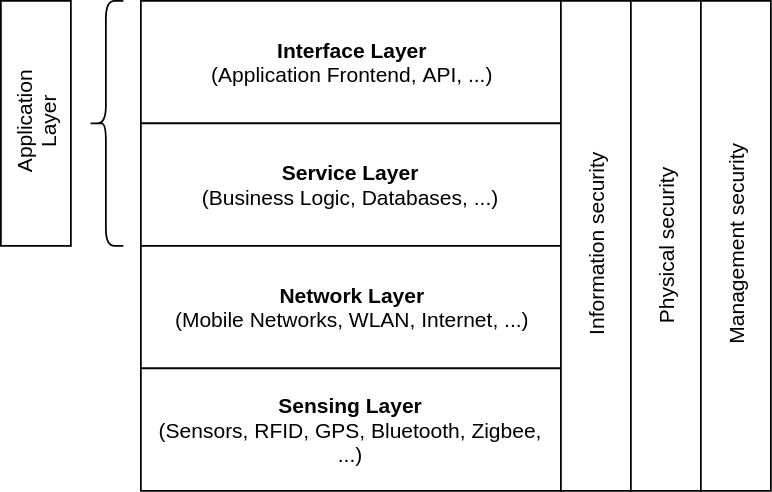

## Sicherheitsarchitektur

*IoT-Sicherheitsarchitektur. Angelehnt an Fig. 3 in [3](quellen.md) und Fig. 2 in [2](quellen.md)*

Die Sicherheitsarchitektur des Internet der Dinge lässt sich, wie in der obigen Grafik abgebildet, in drei Schichten
unterteilen: Wahrnehmungsschicht (Sensing Layer), Netzwerkschicht (Network Layer) und Anwendungsschicht (Application Layer).
Jede Schicht hat jeweils bestimmte Anforderungen an die Informationssicherheit, physische
Sicherheit und Management-Sicherheit. Die Informationssicherheit beschreibt, wie die Daten selbst  gesichert sind, während
die physische Sicherheit den Schutz der Hardware beschreibt. Unter Management-Sicherheit versteht man den Zugriffsschutz
von Daten und Geräten. [2](quellen.md)

### Wahrnehmungsschicht
In der Wahrnehmungsschicht befinden sich Geräte, die Daten von Sensoren zusammentragen, diese verarbeiten und anschließend
weiterleiten. Viele Geräte sind sehr klein und haben meist nur wenig Leistungsressourcen. So besteht die Gefahr, dass
Angreifer Geräte direkt angreifen und so Datenpakete direkt am Gerät abgreifen. Auch die Zerstörung und Diebstahl von IoT-Endgeräten
ist möglich. Außerdem können Angreifer versuchen, eigene IoT-Geräte in das System einzubinden und falsche Daten zu liefern.
Wegen der geringen Leistungsfähigkeit der IoT-Geräte und der meist sehr begrenzten Bandbreite der eingesetzten Nahfunktechnologien
wie Zigbee oder Bluetooth besteht zusätzlich die Gefahr von Denial of Service-Angriffen (DoS). Hierbei ist das Endgerät für legitime Teilnehmer des Systems
nicht mehr erreichbar. [2](quellen.md)

### Netzwerkschicht
Da sich die Netzwerkschicht um das Weiterleiten von Datenpaketen kümmert und diese über viele verschiedene Arten von Netzwerken
übertragen werden, können viele Sicherheits- und Kommunikationsprobleme auftreten. Der Sicherheitsschwerpunkt der Netzwerkschicht
liegt bei der Informationssicherheit. Informationen müssen sicher (zum Beispiel verschlüsselt) übertragen werden und die Datenintegrität
muss sichergestellt werden.
[2](quellen.md)

### Anwendungsschicht
Die Anwendungsschicht erhält Informationen aus den darunterliegenden Schichten und verarbeitet diese.
Sie ist in zwei weitere Schichten unterteilt: Die Service-Schicht (Service Layer), welche die Business Logik
sowie Datenbanken enthält, und die Interface-Schicht (Interface Layer), welche verschiedenen Schnittstellen zur Verfügung
stellt: Zum Beispiel Benutzeroberflächen (application frontend) oder APIs.

Die Service-Schicht ist dabei für die Verarbeitung und Speicherung der Informationen zuständig, wohingegen die darüber liegende Interface-Schicht
nur Schnittstellen für Benutzer und andere Dienste/Programme anbietet. Der Sicherheitsschwerpunkt bei der Service-Schicht liegt
bei der Informationssicherheit (sichere Speicherung von Daten), wobei bei der Interface-Schicht der Sicherheitsschwerpunkt bei
der Management-Sicherheit liegt. Die Interface-Schicht hat dafür zu sorgen, dass unberechtigte Personen und Dienste sowie Programme
nicht auf Daten und Funktionen zugreifen können. Dies wird meist über verschiedene Authentifizierungsverfahren gelöst.
Bei Diensten mit mehreren Benutzern muss außerdem sichergestellt werden, dass Benutzer nicht auf Daten und Funktionen
von anderen Benutzern zugreifen können.
[2](quellen.md)
