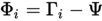

# Eigenfaces
Eigenfaces (auf deutsch Eigengesichter) ist ein von Matthew Turk und Alex Pentland entwickeltes Verfahren, um Gesichter einer Person oder bestimmten Merkmalen zuordnen zu können. Dabei setzt Eigenfaces auf eine Principal Component Analyse (PCA) auf deutsch Hauptkomponentenanalyse. Die Principal Component Analyse dient dazu mit einer Anzahl an statistischen Variabeln sich einer möglichst aussagekräftigen Linearkombination zu nähern. Dieses Verfahren ist besonders in der Bildverarbeitung beliebt.[10]

## Funktionsweise
Siehe: [5] (Die Rechnung ist ein wenig verkürzt aus Wikipedia kopiert und steht hier zum Verständnis der Funktionsweise.)

Hinweis: Die Rechnung erfolgt mit Hilfe der Matrix des Bildes (wie auch im Kapitel OpenCV beschrieben). Man darf sich dabei ein Bild als Matrix vorstellen. Auch das Differenz- und Durchschnittsbild sind Matrizen.

* Schritt 1: In jenem Verfahren werden eine Trainingsmenge an Bildern von Gesichter in lexikographischer Reihenfolge eingelesen und in Vektoren einer Länge k gespeichert.
 

* Schritt 2: Aus der Trainingsmenge wird schließlich ein Durchschnittsgesicht gebildet.
 

* Schritt 3: Anschließend wird von jedem Bild aus dem Trainingsset ein Differenzbild zum Durchschnittsgesicht gebildet.
 

* Schritt 4: Sind die Differenzbilder vollständig berechnet, kann man eine Kovarianzmatrix erstellen.
 

* Schritt 5: Allerdings ist bei einer Kovarianzmatrix der Nachteil vorhanden, dass für einen modernen Computer schon das Rechnen von einer Anzahl von 300 100x100 Pixel großen Bildern rechenaufwendig ist. Um dies zu verhindern sollten die Eigenvektoren statt in einer Kovarianzmatrix in einer neuen Marix berechnet werden.
 

Das dies möglich ist, wird bewiesen durch:
 * Schritt 5.1: Sei die Eigenwertzerlegung von der Kovarianzmatrix gegeben durch:
 

 * Schritt 5.2: Da die Kovarianzmatrix eine zu große Matrix ist, wird in diesem Schritt die Eigenwertzerlegung für L betrachtet.
 

 * Schritt 5.3: Bei linksseitiger Multiplikation mit A ergibt sich:
 

 * Schritt 5.4: Sei nun 
 

so ergibt sich aus der Eigenwertzerlegung von L dieselbe wie von C. Damit ist es bewiesen. Die erhaltenen Vektoren von v sind die Eigenvektoren, wobei nur die mit den höchsten Eigenwert von Interesse sind. Die u's müssen noch normalisiert werden.
* Schritt 6: Schlussendlich können die ausgerechneten Eigengesichter dann in einem Gesichtsraum projiziert werden, so dass man den daraus erhaltenen Vektor für die Gesichtswiedererkennung nutzen kann.
 

* Schritt 7: Der aus Schritt 6 erhaltene Vektor lässt sich für die Gesichtswiedererkennung nutzen:
 

## Eigenfaces in OpenCV
Natürlich ist es nicht notwendig in OpenCV die komplette Berechnung selbst einzuprogrammieren. Dies wäre entsprechend viel Arbeit, ließe sich aber durch die Mat Klasse bewerkstelligen. Die Berechnung der Eigenfaces ist in OpenCV in einem Zusatzmodul namens Contrib vorhanden. Dieses muss zusätzlich zur OpenCV Library kompiliert oder kann auch in den Binaries zusätzlich installiert werden. Die Darstellung der Funktionsweise dient zum Verständnis, wie das Ganze eigentlich funktioniert.

OpenCV bietet noch eine kleine Besonderheit. Wenn man ein Bild auf das Trainingsset überprüfen lässt, ist es möglich einen Wert namens "Confidence" aus der Funktion herauszuholen. Der Confidence Wert errechnet sich nach der kNN (k-Nearest-Neighbour [auf dt. Nächste-Nachbarn-Klassifikation]) Methode und gibt die Distanz zu dem am ähnlichsten gefundenen Bild aus dem Trainingsset wieder.[6-7]
