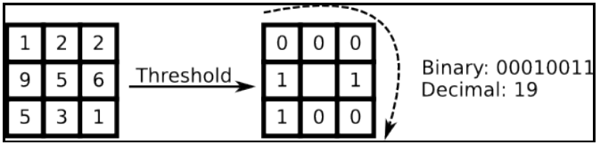
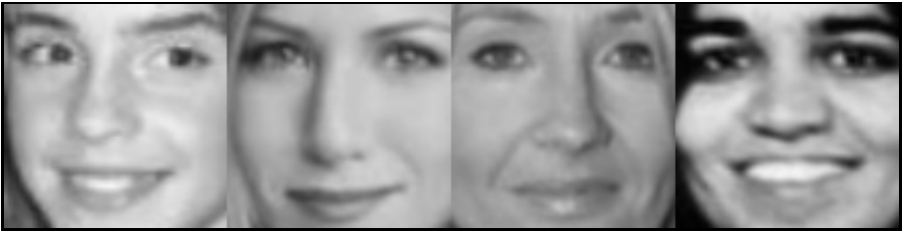
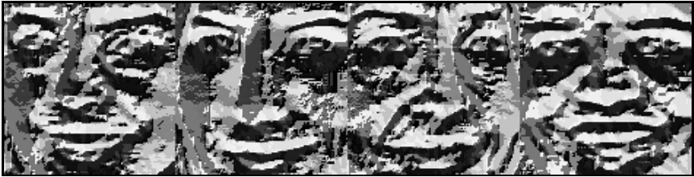
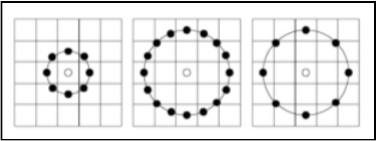
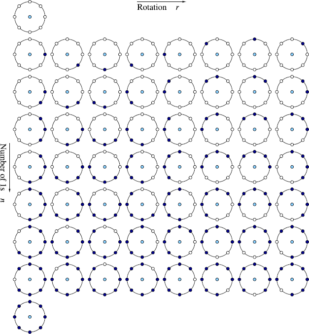
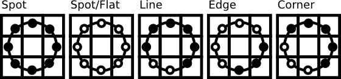

# LBPH
Die Kurzform von LBPH steht für Local Binary Pattern Histograms und kann auch für die Gesichtserkennung eingesetzt werden. Die Local Binary Pattern (LBP) sind Teil des Textur Spektrum Modells von 1990 und wurden 1994 erstmals beschrieben.[12] LBPH wird ebenfalls zur Gesichtserkennung eingesetzt, im Sinne das das Gesicht klassifiziert werden kann.

## Funktionsweise von LBP
Geht man wieder bei einem Bild von einer Matrix aus (s. Kapitel OpenCV), so lässt sich eine Tabelle, wie in folgender Abbildung aufbauen:
 

 *Abbildung einer Matrix[1.6]*
 
Hier handelt es sich um ein Bild mit einer 3x3 Matrix (stark vereinfacht). LBP gibt es dabei in verschiedenen Varianten.

Die erste Variante (siehe folgende Abbildung links) und die übliche Standardvariante ist es, dass man den Intensitätwert eines Mittelpunktes als Basis nimmt und anschließend für alle Nachbarpixel einen Wert zwischen 0 und 1 festlegt. 1 ist es dann, wenn der Nachbarpunkt größer ist als der Wert des Mittelpunktes. 0 dann, wenn es kleiner oder gleich ist.[1.6]

Anschließend werden in einer beliebigen Reihenfolge im Uhrzeigersinn die Nachbarpunkte in eine Zahlenreihe zusammengestellt und im Binärformat aufgeschrieben. Aus dem Binärformat wird dann die Dezimalzahl ermittelt und als neuer Intensitätswert für den Mittelpunkt festgelegt. Dieses Verfahren wiederholt sich für jeden Pixel im Bild. Wichtig ist hierbei, dass man die einmal zuvor beliebig festgelegte Reihenfolge für jeden Pixel in derselben Reihenfolge wiederholt. Diese Variante nennt man auch LBP 8,1.[1.6]

 
 
*LBP Anwendung als Beispiel - oben sieht man das Original, unten nach Anwendung von LBP[1.6]*

Die zweite Variante ist ähnlich wie die Erste. Mit dem Unterschied, dass hier statt den direkten Nachbarn die einen weiter außen liegenden Nachbarn verwendet werden (siehe Mitte der folgenden Abbildung). Dann hat man 8 statt 16 Nachbarn und daraus ergibt sich der Name LBP 16,2.[1.6]
 

 *Illustrierung von LBP Varianten[1.6]*
 
Die zweite Variante verbaucht natürlich doppelt soviel Rechenzeit für jedes Pixel, wie die Erste. Man kann dies auch verkürzen indem man nur jedes 2. Nachbarpixel verwendet. Dies wäre dann im Namen LBP 8,2. Auffallend beim Namen ist, dass die erste Zahl der Anzahl der Nachbarpixel und die zweite Zahl die Zahl des Nachbarrings entspricht.[1.6]

Weiterhin gibt es noch eine Variante von LBP, die wichtig für die Erstellung von LBP Histograms ist (und damit auch wichtig für die Gesichtserkennung). Es ist bewiesen worden, dass nur bestimmte uniform Pattern (auf deutsch bekannte Muster) für LBP Histograms sind.[1.6]

Um ein uniform Pattern zu erkennen braucht man eine binäre Zahl (hier werden 8 Bits als Beispiel genommen) und geht sie von links nach rechts durch. Dabei werden Bittransitionen gezählt. Eine Bittransition ist dann vorhanden, wenn die Zahl sich von 0 auf 1 verändert und umgekehrt genauso. Wichtig hierbei ist zu beachten, dass auch der letzte Bit mit den ersten Bit verglichen wird.[1.6]

Ein Beispiel wäre: 00011101 
Folgende Transitionen sind vorhanden:
* Vom 3. zum 4. Bit 0 -> 1
* Vom 6. zum 7. Bit 1 -> 0
* Vom 7. zum 8. Bit 0 -> 1
* Vom 8. zum 1. Bit 1 -> 0

Ein uniform Pattern darf allerdings nur maximal 2 Bittransitionen haben. Damit wäre unser Beispiel kein uniform Pattern. Folgendes Bild zeigt Beispiele an uniform Patterns.[1.6]
 
 
*Beispiel für ein uniform Pattern.[13]*
 
Damit ist gezeigt, dass es bei einem 8 Bit Binärcode es insgesamt 58 uniform Patterns gibt. Diese werden auch "uniform pattern LBP histogram" genannt.[1.6]

Uniform Patterns führen zu einer stärkeren Effizient und kompakteren Repräsentierung des LBPH. Nun muss noch betrachtet werden, was LBPH überhaupt über das Bild erzählt. [1.6]

 
*Beispiel eines verschieden beleuchteten Jungen in LBP.[14]*

Betrachten wir den Jungen aus dem Beispielfoto oben. Auffallend hierbei ist, dass LBP besonders dort Konturen zeichnet, wo eine Intensitätsveränderung im Bild zu sehen ist. Wenn man jetzt sich vorstellen möchte, wo die Uniform Patterns auftauchen werden. Dann kommt man zum Endschluss, dass sie dort auftauchen, wo mindestens 6 Nachbarpixel entweder heller oder dunkler sind. Diese Pixel werden als gesondert betrachtet und sind vergleichbar mit einer Kante, einer Linie usw. im Bild. (Siehe nachfolgende Abbildung.) Auch ist ein klarer Vorteil von LBPH, dass das Bild überbelichtet oder unterbelichtet sein kann, dennoch wird es in der Regel zum selben LBP Ergebnis führen. [1.6]

 
*LBPH übertragen auf herkömmliche Bildmuster.[15]*

Betrachtet man den Jungen im Kontext zur Erkennung des Gesichts, so wird einen schnell klar, dass ein Gesicht fast immer übereinstimmende uniform Patterns aufweisen wird. Egal wie beleuchtet das Gesicht ist. Anhand eines Trainingssets ist es dann möglich, das Gesicht aus unterschiedlichen Perspektiven zu erkennen. Damit ist LBPH eine gute Methode zur Gesichtserkennung. [1.6]

## LBPH in OpenCV
Die LBPH Funktion findet sich wie die Fisher- und Eigenfaces im OpenCV Contrib. Anzumerken ist nur, dass LBPH das sogenannte Extended Local Binary Pattern nutzt und man die Zahl der Nachbarpickel, den zu betrachtenden Radius und den zu betrachtenden Grid im Bild selbst einstellen kann. (Dies ist aber optional!) Auch kann man sich die model infos vom LBPH Recognizer dann nochmal hinterher per Funktion anzeigen lassen. Confidence gibt es dann per kNN, wie auch bei den anderen Gesichtserkennungen. [16]
