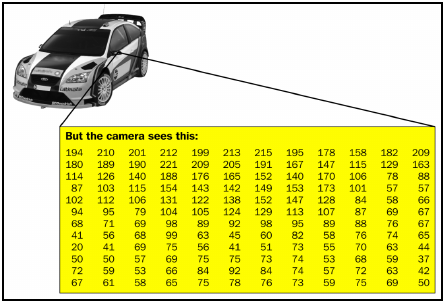
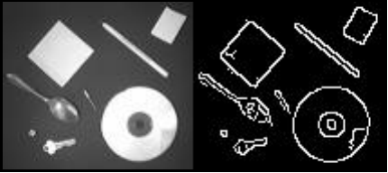

# OpenCV
## Was ist OpenCV?
OpenCV ist eine Programmbibliothek für Computervision und Maschinenlernen, welche unter einer OpenSource Lizenz steht. Es ermöglicht Softwareentwicklern Applikationen, die mit der Computervision zusammenhängen, zu entwickeln. Dabei besitzt OpenCV eigene Mechanismen für die effiziente Speicherverwaltung, der Bildverarbeitung und den Beschaffen von Bildern. OpenCV selbst ist in C++ programmiert, kann aber sowohl in den Programmiersprachen C++, als auch Python benutzt werden. Auch gibt es Schnittstellen von OpenCV für andere Programmiersprachen, wie zum Beispiel Java.[1.1]

## Die Klasse Mat
Den Kernpunkt von OpenCV bildet eine Klasse namens Mat. Das was wir als Bilder sehen, ist in Wirklichkeit eine Aneinanderreihung von Informationen, auch Pixel genannt. Ein Pixel besteht bei einem Graustufenbild aus 8 Bits. Genauer gesagt aus 255 Möglichkeiten an Intensitäten zwischen Schwarz und Weiß. Ein Farbbild wird aus den Elementarfarben Rot, Grün, Blau gebildet. Dabei kann jede einzelne der drei Elementarfarben in einer Intensität von 0 bis 255 vorkommen. Aus eben jenen Informationen können bis zu 24 Bit Farben entstehen. Das entspricht einer Zahl von 16.777.216 Farben. Diese sind für ein Farbbild ausreichend und auch für das menschliche Auge wahrnehmbar.[1.1]

Ein Farbbild oder auch Graubild sind damit in Wirklichkeit eine 2-dimensionale Matrix in einer Aneinanderreihung von Informationen bzw. Pixeln. Die Klasse Mat sorgt für eine effiziente Speicherverwaltung und besteht aus einem Value und einem Header. Der Value ist die Matrix, die das Bild repräsentiert. Der Header enthält Informationen über die Matrix, wie zum Beispiel die Größe und die Anzahl der Pixel, sowie einen Pointer, der den Speicherbereich im Speicher addressiert. Farbbilder werden in 3 Channels in der Klasse unterteilt. Jeweils ein Channel für eine der drei Elementarfarben. Sollte nur ein Channel vorhanden sein, so ist das Bild schwarz/weiß. Aus der Klasse Mat kann ein Objekt abgeleitet werden. Dieses Objekt repräsentiert dann ein Bild.[1.1]

 
*Veranschaulichung einer Matrix zu einem Bild.[1.1]*

## Kanten- und Blurerkennung in OpenCV##
OpenCV ist insgesamt eine mächtige Library. Verschiedene Arten von Detektoren, Filtern und Bildableitungen erlauben es Informationen aus Bildern zu extrahieren. So ist es zum Beispiel möglich, Kanten in OpenCV zu erkennen. Eine Kante in einem Bild wird von OpenCV als starke Intensitätsveränderung von zwei Pixeln definiert. Wie man auch in folgendem Beispiel erkennen kann:[1.2]

 
*Beispiel von Kanten in OpenCV.[1.3]*
 
Anhand des rechten Bildes sieht man, dass OpenCV die Kanten dort zeichnet, wo es zu einer starken Intensitätsänderung zwischen Pixeln kam. Damit ergibt sich für die Maschine das, wo das menschliche Auge Konturen von Gegenständen wahrnimmt. Um ein solches Bild zu zeichnen, kann man bei OpenCV den Gaussian Filter oder den Sobel derivative Filter" einsetzen. Auch kann OpenCV die Kanten selbst erkennen, dies geschieht zum Beispiel mit den "Sobel Detector", den "Canny Edge Detector" oder den "Laplacian Operator".[1.3]

Auch ist es möglich eine sogenannte "Blur" auf Deutsch "Weichzeichnung" in einem Bild zu erkennen. Dies geschieht ebenfalls mit den "Laplacian Operator". Eine Weichzeichnung ist das Gegenteil einer Kante. Eine Weichzeichnung tritt dann auf, wenn die Intensitäten zwischen Pixeln ähnlich sind und nicht stark von einander abweichen.[1.3]
