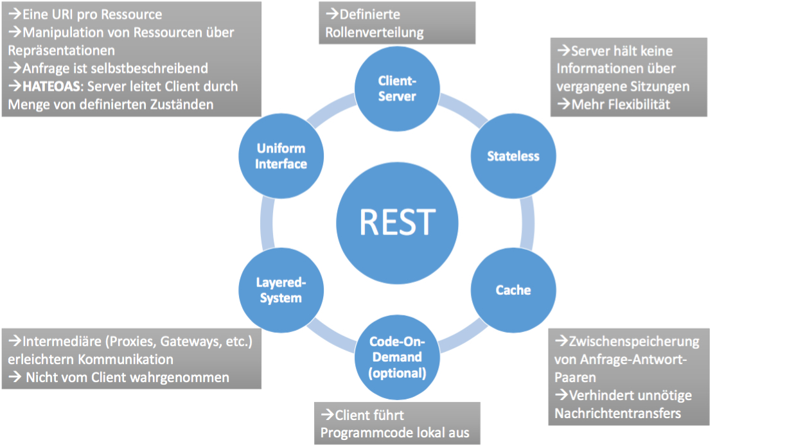
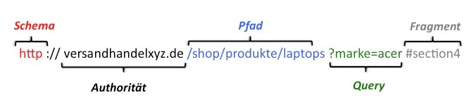
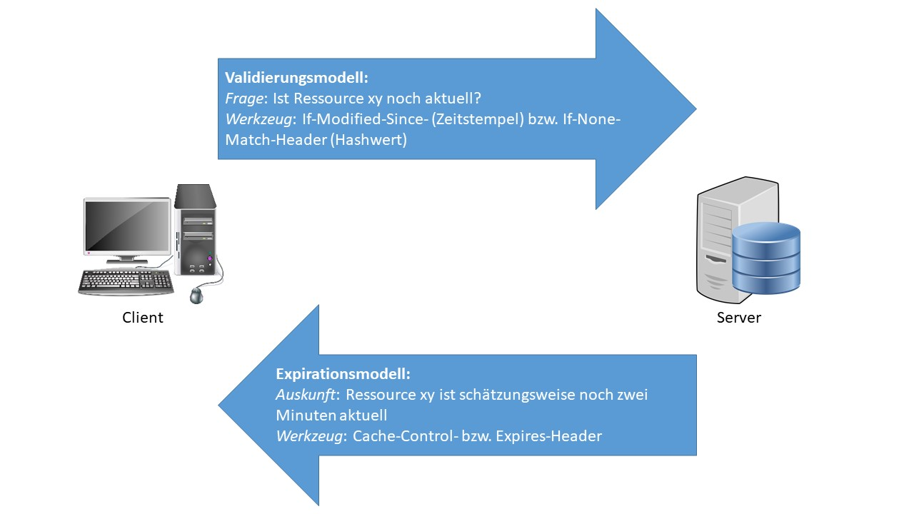
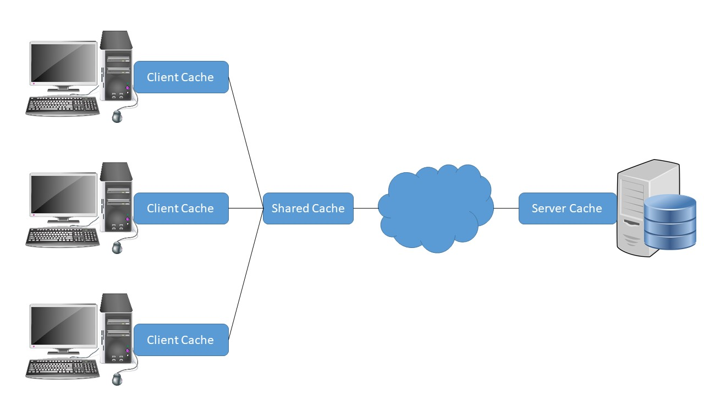
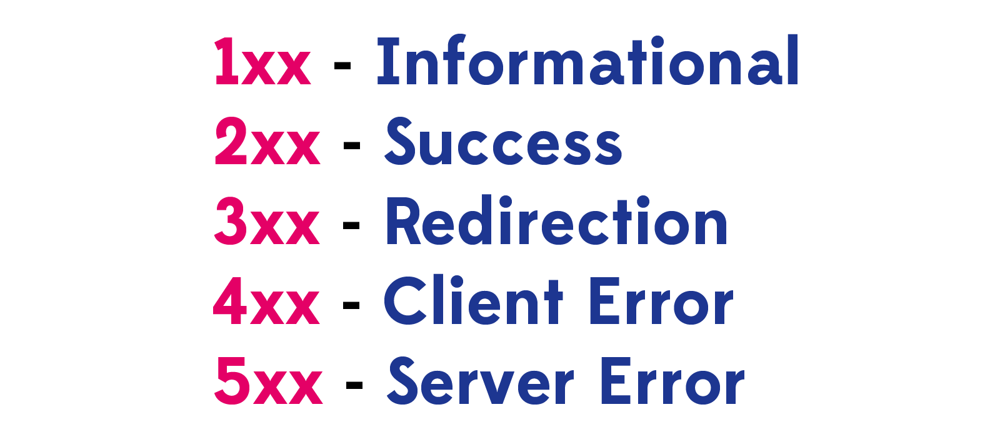
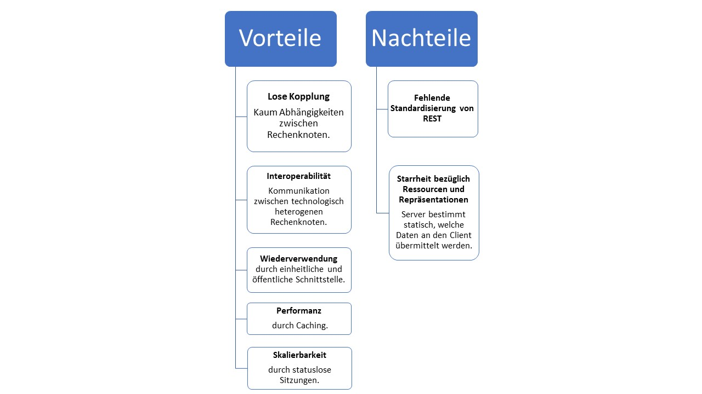

# REST

Representational State Transfer \(REST\) ist ein Architekturstil für verteilte Systeme, der von Roy Fielding innerhalb seiner im Jahr 2000 abgeschlossenen Dissertation "Architectural Styles and the Design of Network-based Software Architectures" entworfen wurde. REST beschreibt auf abstrakte Weise, wie das World Wide Web idealerweise aufzubauen ist. Die lose Kopplung einzelner Komponenten sowie ihre einheitliche Kommunikation untereinander sind nach Fielding die wesentlichen Voraussetzungen eines effizienten und dynamisch skalierbaren WWW. REST ist in seiner ursprünglichen Form dabei gänzlich unabhängig von Techniken sowie Werkzeugen und spezifiziert lediglich einen theoretischen Ansatz. \[vgl. Pautasso et al. 2014, S. 1\]

## Konzepte

### Constraints

Entgegen den meisten Behauptungen ist nicht jede Applikation, die Daten in Abhängigkeit des angefragten URI übermittelt, konform hinsichtlich des REST-Standards. Damit sich ein Service als RESTful bezeichnen darf, muss er Fielding zufolge eine Menge von Constraints erfüllen \(vgl. Fielding 2000, S. 76-85\). Diese werden im Folgenden erläutert. Zur groben Übersicht dient Abbildung 3.

Abbildung 3: Veranschaulichung REST-Constraints

* **Client-Server**: REST kann als hybrider Architekturstil bezeichnet werden, da er auf bereits bestehende Paradigmen, wie beispielsweise das Client-Server-Modell zurückgreift. Für REST ist eine strikte Trennung zwischen der Geschäftslogik des Dienstes und der Schnittstelle des Benutzers fundamental. Die hierdurch erreichte lose Kopplung ermöglicht sowohl die Nutzung von Services unabhängig des verwendeten Endgeräts als auch die getrennte Weiterentwicklung von Client- bzw. Serverkomponenten.
* **Stateless**: RESTful Services müssen zustandslos sein. Die Server-Komponente darf demnach keine Informationen über ihre jeweiligen Clients halten. Dieses Constraint impliziert, dass jeder Aufruf eines Clients sämtliche für die Verarbeitung erforderlichen Informationen beinhalten muss. Der Client hat demnach die Verantwortung seine relevante Daten selber zu verwalten und dem Server bei jedem Aufruf geeignet mitzuteilen. Der Vorteil dieses Verfahrens liegt darin, dass die Performanz des Servers erheblich gesteigert wird. Dieser muss keine aufwändigen Lese- und Schreiboperationen zur Verwaltung der Benutzerdaten durchführen, sondern kann Anfragen ausschließlich anhand ihrer Semantik beantworten. Im Fall eines Serverausfalls bzw. bei unzureichender Lastverteilung ermöglicht das zustandslose Verfahren weiterhin die Umleitung von Clients an eine weitere Server-Instanz, ohne dass diese Kenntnisse bezüglich der Benutzerhistorien haben muss.
* **Cache**: Einen weiteren Beitrag zur Optimierung des World Wide Web leistet Fielding zufolge der Gebrauch von Caching. Ziel ist es, den Server zu entlasten und damit die Performanz von Datenaustauschen zu verbessern. Hierzu platziert sich in der Regel eine weitere Server-Instanz zwischen Client und dem eigentlichen Server bzw. der Client führt das Caching lokal durch. Jede Antwort, die vom Server zurück an den Client versendet wird, ist entweder als cacheable oder non-cacheable zu deklarieren. Eine Antwort, die cacheable ist, wird vom Intermediär inklusive der dazugehörigen Anfrage abgespeichert. Jede weitere Anfrage stellt die Client-Instanz nun an den Intermediär, der diese mit seinen abgespeicherten Anfragen vergleicht. Im Fall einer Übereinstimmung wird die dazugehörige Antwort direkt an den Client geliefert, ohne dass der Server in die Kommunikation involviert ist. Befindet sich die Anfrage nicht im Cache, wird sie zwecks normaler Verarbeitung an den Server weitergeleitet. Caching soll sicherstellen, dass der Server niemals die gleiche Antwort zweimal generieren bzw. übermitteln muss.
* **Uniform Interface**: Einheitliche Schnittstellen zwischen Client- und Server-Instanzen sind eine wesentliche Abgrenzung von REST zu anderen Architekturstilen. Sie verbessern die Nachvollziehbarkeit von Nachrichtenaustauschen für Außenstehende und ermöglichen den Aufruf von Services ohne genauere Kenntnisse der jeweiligen Implementierung. Aufgrund der Allgemeinheit des Constraints vollzieht Fielding eine Verfeinerung in vier Unter-Constraints.

  * _Identification of resources_: Jede Ressource eines Dienstes wird über einen eindeutigen URI abgebildet. 
  * _Manipulation of resources through representations_: Wenn der Client Kenntnis von der Repräsentation einer Ressource besitzt, kann er diese nutzen, um die Ressource auf Serverseite zu manipulieren. Hält der Client beispielsweise eine JSON-Repräsentation einer Ressource Bestellung, kann er hiermit die Ressource serverseitig ändern \(vorausgesetzt er besitzt die nötigen Zugriffsrechte\). Weitere Benutzer, die sich eben diese Bestellung beispielsweise als XML-Objekt repräsentieren lassen, erhalten nun auch die manipulierte Version.
  * _Self-descriptive messages_: Jede einzelne Nachricht enthält alle Informationen, die für ihre Verarbeitung nötig sind. Anfragen spezifizieren die Ressource, auf die sich beziehen, und die auszuführende Methode auf dieser Ressource. Im Fall, dass weitere Daten mitgesendet werden, muss zudem der Datentyp deklariert werden. Antworten hingegen sind als cacheable bzw. non-cacheable zu markieren.
  * _HATEOAS_: Hypermedia as the engine of application state \(HATEOAS\) ist ein zentrales Prinzip von REST. Der Kerngedanke dahinter ist, dass der Client Ressourcen nicht selbstständig über URIs abfragt bzw. Kenntnisse von einer API hat, sondern für die gesamte Interaktionsdauer vom Server geführt wird. Nimmt der Client initial Kontakt mit dem Server auf, erhält er eine Antwort, in der spezifiziert ist, welche weiteren Anfragen möglich sind. Tätigt der Client eine dieser Anfragen, erhält er wiederum eine neue Menge von Anfragen, die aus seinem aktuellen Status getätigt werden können. Diese Prozedur wiederholt sich bis zum Ende der Kommunikation. Eine Antwort seitens des Server enthält somit nicht nur das Ergebnis der eigentlichen Anfrage, sondern auch die nächsten potentiellen Interaktionsmöglichkeiten. Diese Möglichkeiten liefert der Server in der Regel über src- bzw. href-Attribute innerhalb des zurückgelieferten HTML-Objekts aus. Weiterhin kann er dem Client ein Formular senden, in dem dieser nur eingeschränkte Auswahlmöglichkeiten besitzt, was seine potentiellen Aktionen ebenfalls eingrenzt. HATEOAS baut somit auf dem Prinzip des endlichen Automatens auf. Ein Client gelangt in einen Initialzustand, für den eine Menge von Transitionen vom Server festgelegt sind. Mit jeder Transition erhält der Client die Informationen seines neuen Zustands sowie neue Transitionsmöglichkeiten vom Server vorgelegt. Diese Prozedur ist aus dem folgenden Beispiel \(siehe Abb. 4\) ersichtlich. Der Client gelangt initial auf die Homepage des RESTful Dienstes Versandhandel. Von diesem Zustand ermöglicht der Server ihm ausschließlich die Transition in den Status "Alle Produkte anzeigen". Gelangt er in diesen Status, kann er ein spezifisches Produkt anfragen bzw. eine Rücktransition vollziehen. Lässt er sich ein spezifisches Produkt anzeigen, kann er dieses erwerben bzw. eine Bestellung abschicken oder zurück auf die Startseite wechseln. Jeder Status beinhaltet demnach die tatsächlich angefragten Informationen, wie beispielsweise die Darstellung sämtlicher Produkte, als auch die möglichen Transitionen zu neuen Status. Welche Status und Transitionsmöglichkeiten existieren, gibt alleine der Server vor. Hierdurch entstehen diverse Vorteile. Die Komplexität auf Seiten des Clients wird erheblich verringert, da dieser keine API verinnerlichen muss, sondern ausschließlich vom Server gelenkt wird. Hierdurch wird auch das Risiko von inkorrekten Anfragen gesenkt. Weiterhin kann der Server flexibler agieren. Er stellt dem Client ausschließlich die Ressourcen zur Verfügung, die im aktuellen Moment tatsächlich angefragt werden können. Ist ein Produkt nicht mehr im Sortiment, kann sich der Client dieses auch nicht mehr anzeigen lassen. Im Fall, dass der Server ausgelastet ist, kann er den Client dynamisch an eine weitere Server-Instanz verweisen, ohne dass dieser Kenntnis davon hat.


Abbildung 4: HATEOAS am Beispiel Versandhandel


* **Layered-System**: Ein geschichtetes System soll die lose Kopplung innerhalb des World Wide Web weiter vorantreiben. Das Ziel ist es, die Komplexität von Diensten zu verringern, ohne weitere Änderungen an ihnen vorzunehmen. Hierzu werden weitere Schichten zwischen Client und Server gesetzt. Hierunter können Proxy-, Gateway- oder andere Server-Instanzen verstanden werden, die diverse Funktionen, wie beispielsweise Caching, Vermittlung oder Übersetzung von Anfragen, übernehmen. Diese Intermediäre sind so einzusetzen, dass für den Client keine zusätzlichen Anstrengungen bezüglich des Kommunikationsaufbaus entstehen. Er weiß also zu keiner Zeit, ob er direkt mit dem Server oder mit einem Intermediär kommuniziert, da ihre Schnittstellen identisch sind.

* **Code-On-Demand**: Unter Code-On-Demand ist die Übermittlung von Programmcode vom Server an den Client zu verstehen. Sowohl Client als auch Server können hierdurch entlastet werden, da Operationen nun lokal beim Anwender aufgerufen werden können, ohne dass eine Übermittlung von Eingabe-Parametern bzw. Programmergebnissen stattfinden muss. Fielding sieht es jedoch als optionales Constraint an, da es die Nachvollziehbarkeit einer Kommunikation verringert, wenn der Client teilweise seine eigenen Berechnungen durchführt.

### Ressourcen und Repräsentationen

Der Austausch von Informationen zwischen Client und Server ist die Grundlage von verteilten Systemen. REST führt hier eine weitere Differenzierung durch und teilt Informationen in Ressourcen und Repräsentationen ein. Ressourcen bilden die Ausgangsbasis und stellen in der Regel Objekte des realen Lebens dar. Beispielhaft für eine Ressource ist ein Mensch oder ein Auto. Auch nicht greifbare Objekte können Ressourcen sein, wie zum Beispiel eine Bestellung. Eine Ressource kann weiterhin durch eine beliebige Anzahl an Repräsentationen beschrieben werden. Eine Repräsentation der Ressource Auto ist beispielsweise ein JSON-Objekt, in dem alle technischen Daten des Autos aufgelistet sind. Auch ein Foto im JPEG-Format, auf dem das Auto abgebildet ist, kann als Repräsentation verstanden werden. Der Vorteil der Abgrenzung von Ressourcen und Repräsentationen ist die daraus resultierende Flexibilität. Der Server speichert alle Daten, die er einer Ressource zuordnen kann in einer Datenbank ab. In Abhängigkeit davon, welche Darstellung der Client bevorzugt, kann er aus diesen Daten dynamisch eine geeignete Repräsentation generieren und übermitteln. Unabhängig davon, welche Repräsentation angefordert wird, bleibt die Aufrufroutine für eine Ressource jedoch immer gleich. Lediglich die übermittelten Informationen ändern sich. HTTP erlaubt beispielsweise, den bevorzugten Typ einer angefragten Ressource in dem Headerfeld der Anfrage mitzusenden. \(vgl. Tilkov et al. 2015, S. 35-36\)

\(Tilkov et al. 2015, S. 36-39\) teilen Ressourcen weiterhin in verschiedene Unterkategorien ein, um die Übersichtlichkeit eines RESTful Services zu steigern:

* **Primärressourcen**: Unter Primärressourcen sind Ressourcen im eigentlichen Sinn zu verstehen. Jedes Objekt, welches ein elementarer Bestandteil des Dienstes ist, ist dieser Kategorie zuzuordnen. Ein Dienst, der dem Verkauf von Autos dient, wird somit höchstwahrscheinlich eine Primärressource Auto aufweisen. Jedoch kann auch eine Bestellung oder ein Kunde hier als Primärressource angesehen werden.
* **Subressourcen**: Subressourcen sind die elementaren Bestandteile übergelagerter Ressourcen. Die Primärressource Auto könnte beispielsweise die Subressourcen Motor und Lenkrad umfassen.
* **Listenressourcen**: Listenressourcen kommen immer dann zum Einsatz, wenn man nicht auf eine einzelne Primär- bzw. Subressource zugreifen möchte, sondern auf die Gesamtheit aller Ressourcen des Typs. Die Listenressource Autos kann beispielsweise alle Primärressourcen Auto umfassen, welche aktuell zum Verkauf angeboten werden.
* **Filter:** Eine nach einem bestimmten Kriterium gefilterte Listenressource ist als Filterressource anzusehen. Beispielhaft dafür seien alle zu verkaufenden Autos mit mehr als 150 PS.
* **Paginierung**: Eine Paginierung teilt eine Listenressource auf einzelne Seiten auf, sodass eine übersichtliche Darstellung erfolgen kann.
* **Projektionen**: Werden nur bestimmte Informationen einer Ressource benötigt, kann eine Projektion erfolgen. Beispielsweise wird für die Listenressource Autos nur das Bild und das Modell des jeweiligen Autos für die Darstellung benötigt. Die Informationen bezüglich der Leistung müssen zwecks Performanz somit nicht übermittelt werden.
* **Aggregationen**: Sollen bestimmte Attribute verschiedenartiger Ressourcen in einer einzelnen Antwort übermittelt werden, ist eine Aggregation durchzuführen.
* **Aktivitäten**: Schritte innerhalb einer Verarbeitung sind den Aktivitäten zuzuordnen. Hierbei handelt es sich um nicht greifbare Tätigkeiten, die dennoch als Ressourcen abegelegt werden. Kauft man beispielsweise ein Auto bei einem Dienst, kann initial eine neue Ressource "SCHUFA-Prüfung" angelegt werden, die die Kreditwürdigkeit feststellen soll.

### URIs

Ein Universal Resource Identifier \(URI\) definiert den Zugriffsort einer einzelnen Ressource in einem Netzwerk. Der Identifikator muss dabei nach einem standardisierten Schema \(siehe Abb. 5\) aufgebaut sein, welches fünf Teile spezifiziert \(vgl. Berners-Lee 2005, S. 16-24\).




Abbildung 5: Beispielhafter Aufbau eines HTTP-URI


* **Schema:** Unter dem Schema kann das Protokoll verstanden werden, mit dem die jeweilige Ressource anzufragen ist. Hierzu sind neben Hypertext Transfer Protocol \(HTTP\) und File Transfer Protocol \(FTP\) auch beispielsweise Lightweight Directory Access Protocol \(LDAP\) und Teletype Network \(Telnet\) zu zählen. Für REST wird jedoch in der Regel HTTP verwendet.
* **Authorität**: Die Authorität bezeichnet die Organisation, der die angebotene Ressource unterliegt. In manchen Fällen ist dieser Authorität zusätzlich eine Portnummer nach- bzw. der die Ressource anfragende Benutzer vorgestellt.

* **Pfad**: Der Pfad beschreibt, an welcher Stelle sich die benötigte Ressource innerhalb der Organisation befindet und ist typischerweise hierarchisch aufgebaut. Einzelne Hierarchiebenen werden dabei mit einem Schrägstrich voneinander getrennt.

* **Query**: Optional ist der Pfad um eine Abfrage zu erweitern. Mit einem Kaufmanns-Und sind beliebig viele Schlüssel-Wert-Paare anzuhängen, die vom Server ausgelesen und in die Verarbeitung miteinbezogen werden.

* **Fragment**: Ein Fragment wird ausschließlich auf Seite des Clients aufgelöst und nicht per Anfrage an den Server übertragen. Die konkrete Verwendung des Fragments ist dabei abhängig vom verwendeten Protokoll bzw. von dem Medientyp der Antwort. Wird beispielsweise ein HTTP-URI mit Fragment aufgerufen, der ein HTML-Objekt liefert, scrollt der Browser nach Darstellung der kompletten Webseite automatisch zu dem von dem Fragment beschriebenen HTML-Tag.

Innerhalb von REST sind URIs unerlässlich. Jede Ressource muss über einen definierten URI erreichbar sein. Weiterhin darf sich maximal ein URI auf eine Ressource beziehen. Diese Auflagen garantieren einen eindeutigen und konsistenten Zugriff.

### Verben

Die Semantik einer Anfrage an einen RESTful Service ergibt sich nicht ausschließlich aus der Lokalität der angeforderten Ressource, sondern auch aus der Methode, die darauf angewendet werden soll. HTTP bietet eine Vielzahl an Methoden, die potentiell für REST benutzt werden können. In der Praxis hat sich jedoch nur eine Teilmenge an Methoden etabliert, die auf die grundlegenden Datenbankoperationen \(Create, Read, Update und Delete\) abgebildet werden können. Die Methoden werden im Folgenden nach \(Tilkov et al. 2015, S. 53-59\) beschrieben.

* **GET**: Die grundlegendste HTTP-Methode ist GET. Ein mit GET angefragter Service liefert eine Repräsentation der durch den URI beschriebenen Ressource an den Client zurück. Der Typ der übermittelten Repräsentation kann bereits bei der HTTP-Anfrage festgelegt werden. Im Fall, dass der Server die deklarierte Repräsentation nicht liefern kann, übermittelt er eine andere Repräsentation seiner Wahl.
* **PUT**: Eine bestehende Ressource kann von einem Client auf dem Server manipuliert werden. Dafür muss der Client geeignete Zugriffsrechte und eine Repräsentation der Ressource besitzen. Die veränderte Repräsentation wird nun im Body einer PUT-Anfrage an den URI der Ressource versendet. Im Header wird der Typ der übermittelten Repräsentation spezifiziert, sodass der Server die Daten geeignet verarbeiten kann.
* **POST**: Mit dem POST-Befehl teilt der Client dem Server eindeutig mit, dass eine neue Ressource angelegt werden soll. Äquivalent zum PUT-Befehl wird eine Repräsentation im Body der Anfrage mitgeliefert und im Header beschrieben. Ein Hauptunterschied zwischen PUT und POST ist, dass der URI einer PUT-Anfrage auf eine Primär- bzw. Subressource verweist, während der URI eines POST-Befehls eine Listenressource beschreibt, in die das neue Element einzufügen ist.
* **DELETE**: Soll eine Ressource gelöscht werden, ist der DELETE-Befehl mit dem dazugehörigen URI zu verwenden. In der Regel wird die Ressource jedoch nicht physikalisch aus dem Speicher des Servers entfernt, sondern lediglich als nicht mehr existent gekennzeichnet.

Weiterhin können die beschriebenen Methoden hinsichtlich diverser Faktoren kategorisiert werden. Ein Faktor ist die Sicherheit. Ist eine Methode als sicher einzustufen, kann sie ausgeführt werden, ohne dass dies Auswirkungen auf die gespeicherten Daten des Servers hat. Ein GET-Befehl manipuliert beispielsweise keine serverseitigen Informationen, weshalb er ohne Bedenken genutzt werden kann. Ein PUT-Befehl ist im Gegensatz dazu unsicher, da durch ihn potentiell weitreichende Manipulationen durchgeführt werden können. Idempotenz liegt dann vor, wenn eine Methode beliebig oft auf denselben URI angewendet werden kann, und lediglich die erste Anfrage Auswirkungen hat. Führt man beispielsweise den PUT-Befehl mit gleichem URI und gleichem Body zweimal durch, wirkt nur die erste Anfrage. Die zweite Anfrage wird zwar vom Server abgearbeitet, hat aber keine Auswirkungen, da das Update der Ressource bereits geschehen ist. Ein zweimaliges Posten derselben Anfrage führt im Gegensatz zur Anlage zwei neuer Ressourcen und ist somit nicht idempotent. Die Kenntnis über die Idempotenz einer Methode kann beispielsweise bei Verbindungsstörungen hilfreich sein. Wurde eine Anfrage abgeschickt, ohne dass eine Antwort eingegangen ist, können idempotente Anfragen ohne Sorge wiederholt ausgeführt werden. Selbst wenn der Server die erste Anfrage bereits verarbeitet hat und die Antwort lediglich aufgrund von Latenzproblemen noch nicht zugestellt wurde, hat das nochmalige Senden keine Auswirkungen. Wie schon angeschnitten, unterscheiden sich Methoden bezüglich ihrer Adressierung. Ein GET-Befehl wird immer direkt auf eine einzelne Ressource angewendet und identifiziert diese dementsprechend. Im Gegensatz dazu steht eine POST-Anfrage, die lediglich auf eine Liste angewendet wird und dementsprechend nicht auf eine konkrete Instanz einer Ressource. Letztlich ist eine Differenzierung der Methoden im Hinblick auf ihre Cache-Fähigkeit zu vollziehen. Ein GET-Befehl ist beispielsweise cache-fähig, da er ausschließlich Daten zurückliefert. Diese müssen nicht zwingend vom Server stammen, sondern können auch durch einen Intermediär bereitgestellt werden. Befehle, die Manipulationen auf dem Server einfordern, müssen zwangsweise an diesen zugestellt werden und sind dementsprechend nicht von einer zwischengeschalteten Instanz zu verarbeiten. Sie dienen jedoch der Invalidierung. Wird beispielsweise ein PUT auf eine Ressource ausgeführt, die sich im Cache befindet, ist diese anschließend aufgrund der Manipulation aus dem Cache zu entfernen. Eine detaillierte Gegenüberstellung der HTTP-Methoden bezüglich der genannten Bewertungsfaktoren ist aus Tabelle 2 ersichtlich.

| Methode | Sicher | Idempotent | Identifiziert einzige  Ressource | Cache-fähig |
| :--- | :--- | :--- | :--- | :--- |
| GET | Ja | Ja | Ja | Ja |
| PUT | Nein | Ja | Ja | Nein |
| POST | Nein | Nein | Nein | Nein |
| DELETE | Nein | Ja | Ja | Nein |

Tabelle 2: Vergleich der grundlegenden HTTP-Methoden

Quelle: In Anlehnung an \(Tilkov et al. 2015, S. 59\)

### Caching

Wie sich im vorherigen Abschnitt bereits herausgestellt hat, ist Caching ein essentieller Bestandteil von REST. Die Zwischenspeicherung von Anfrage-Antwort-Paaren soll zum einen den Client unterstützen. Erhält dieser seine angeforderten Informationen, ohne dass sie auf Seiten des Servers aufwändig generiert werden mussten, kann er Zeit einsparen und seine Performanz steigern. Zum anderen wird auch der Server durch Caching entlastet, da ihn weniger Anfragen erreichen. Ohne zu tief in Implementierungsdetails zu gehen, kann ein einzelnes Caching-Verfahren für RESTful Services anhand von zwei Dimensionen charakterisiert werden, wobei auch hybride Ansätze möglich und praktikabel sind. \(Tilkov et al. 2015, S. 127-133\) definieren diese Dimensionen als Modell und Topologie.

##### Modell

Das Modell legt fest, von welcher Instanz das Caching initiiert wird \(siehe Abb. 6\). Beim **Expirationsmodell** erweitert der Server jede von ihm ausgelieferte Nachricht um den Cache-Control-Header. In diesem wird vermerkt, wie lange die übermittelte Repräsentation bzw. die dazugehörige Ressource aktuell ist. Der Server spezifiziert damit, dass sich die jeweilige Ressource in dem festgelegten Zeitraum \(wahrscheinlich\) nicht ändern wird und ermöglicht somit die zielführende Zwischenspeicherung des bereits ausgelieferten Ergebnisses. Nach Ablauf der Zeit sind Anfragen bezüglich der Ressource wieder konventionell an den Server zu richten, bis möglicherweise wieder ein Cache-Control-Header empfangen wurde. Der Vorteil dieses Modells liegt in seiner Effizienz. Es ist kein zusätzlicher Datenverkehr notwendig, um den Client auf die Gültigkeit von Repräsentationen bzw. Ressourcen aufmerksam zu machen. Hierunter leidet jedoch in manchen Fällen die Aktualität von zwischengespeicherten Antworten. Hat sich trotz Versprechen des Servers eine Ressource während der Caching-Zeitspanne verändert, bleibt der Client davon uninformiert und greift weiterhin auf die veralteten Daten zu. In Abhängigkeit des Kontexts kann dies mehr oder weniger schwere Konsequenzen nach sich ziehen. Beim **Validierungsmodell** geht die Interaktion hingegen von Seiten des Clients aus. Die nochmalige Anfrage einer Ressource, von der er bereits eine Repräsentation besitzt, erweitert er um zusätzliche Informationen. Typischerweise ist dies ein Zeitstempel von der erstmaligen Anforderung. Der Server prüft nun, ob die Ressource seit dem angegebenen Zeitpunkt einer Änderung unterlag. Im Fall, dass die Ressource konstant blieb, ist die nochmalige Übertragung nicht nötig. Der Server teilt dem Client nun lediglich mit, dass er mit der früheren Repräsentation weiterarbeiten kann. Sollte jedoch eine Änderung aufgetreten sein, wird die neue Repräsentation im Body mitgeschickt. Anstatt eines Zeitstempels ist es weiterhin möglich, den Hashwert einer Repräsentation zu übergeben. Der Server kann auch hiermit feststellen, ob die clientseitige Repräsentation der Ressource noch immer mit der serverseiten Repräsentation übereinstimmt. Der Vorteil vom Validierungsmodell liegt darin, dass der Client stets mit aktuellen Repräsentationen arbeitet, auch wenn sie nicht erneut durch den Server übertragen wurden. Der Nachteil ergibt sich jedoch dadurch, dass die Einsparung der Kommunikationsaufwände im Vergleich zum vorherigen Modell geringer ausfällt. Der Server muss in jedem Fall die Anfrage des Clients verarbeiten. Effizienz wird lediglich dadurch gewonnen, dass die Antwort teilweise verschlankt wird bzw. keine Repräsentation auf Serverseite zu generieren ist.

Abbildung 6: Veranschaulichung Caching-Modelle

**Topologie**

Die Topologie eines Caching-Verfahren definiert, an welcher Lokalität das Caching stattfindet bzw. wo der Zwischenspeicher angesiedelt ist \(siehe Abb. 7\). Beim **clientseitigen Caching** \(typischerweise in jedem Webbrowser implementiert\) besitzt jeder Client, der mit einer Server-Instanz kommuniziert, seinen eigenen Cache. Der Vorteil liegt darin, dass auch verschlüsselte bzw. vertrauliche Anfragen und Antworten zu cachen sind, da keine Sicherheitsrisiken bezüglich weiterer Nutzer entstehen. Der **clientseitige Shared Cache** bzw. **Proxy-Cache** erweitert diese Topologie. Der Zwischenspeicher gilt nun für eine beliebige Anzahl an Benutzern und ist typischerweise auf einem zwischengelagerten Proxy-Server befindlich. Die Vielzahl der anfragenden Clients erhöht die Chance für das Caching einer später benötigten Repräsentation. Beim **Server-Caching** wird jede an den Server gestellte Anfrage zwischengespeichert und für alle nachkommenden Clients verfügbar gemacht. Zwar erhöht sich die Chance, dass eine Anfrage ohne Berechnung auf Serverseite beantwortet werden kann, jedoch steigen auch die Aufwände. Anfragen sind stets durch das gesamte Netzwerk hindurch zu leiten, bevor sie überprüfbar sind. In der Praxis werden alle Topologien miteinander verknüpft, um bestmögliche Caching-Resultate zu erzielen.

Abbildung 7: Veranschaulichung Caching-Topologien

Quelle: In Anlehnung an \(Tilkov et al. 2015, S. 133\)

### Security

Sicherheit ist für verteilte Systeme und insbesondere RESTful Services ein zentrales Thema. Letztere bieten aufgrund ihrer meist öffentlich zugänglichen Schnittstelle eine breite Fläche für potentielle Angreifer und sind somit zu schützen. \(Levin 2016\) definiert dabei fünf verschiedene Maßnahmen, deren Umsetzung einen sicheren Dienst gewährleisten soll.

1. **Authorisierung**: Wie bereits erwähnt, sind RESTful Services oft öffentlich zugänglich. Dies sei gewollt, um einen Dienst möglichst vielen Nutzern zur Verfügung zu stellen und somit seine Popularität zu steigern. Mithilfe von HATEOAS leitet der Server den spezifischen Client durch eine Menge von für ihn verfügbaren Zuständen. Benutzer, die erweiterte Kenntnisse bezüglich der REST-Schnittstelle haben, können jedoch selbstständig Anfragen an Ressourcen stellen. Obwohl diese Herangehensweise vom Server ungewollt ist, kann er sie nicht unterbinden. Um trotzdem zu verhindern, dass jeder Benutzer potentiell dazu in der Lage ist, jede existierende Ressource einzusehen bzw. zu manipulieren, muss eine Authorisierung erfolgen. Der Client erweitert jede Anfrage um ein Authorisierungsobjekt \(falls er ein solches besitzt\), das in Abhängigkeit des angefragten Dienstes als API- bzw. Session-Key oder Benutzername-Passwort-Paar anzusehen ist. Der Server entscheidet anschließend, ob die beantragte Operation auf der Ressource zu bewilligen ist und führt diese ggf. aus. Welche Benutzergruppen für welche Aktionen befähigt sind, hängt hingegen allein von der Geschäftslogik ab.
2. **Eingabevalidierung**: Auch authorisierte Clients sind nicht zwingend vertrauenswürdig und können dem RESTful Service schaden. Insbesondere durch die Nutzung von POST- und PUT-Befehlen ergeben sich für sie diverse Angriffsmöglichkeiten. Eine simple HTTP-Anfrage, die per POST gestellt wurde, beinhaltet eine Vielzahl an Informationen. Der URI verrät, an welche Ressource die Operation gerichtet ist. Eine breite Anzahl von Headern erweitert diese Information um verschiedenartige Details, die sich sowohl auf die Syntax als auch auf die Semantik der Anfrage beziehen. Im Body kann weiterhin jede erdenkliche Zeichenfolge mitgeliefert werden. Schädlinge können diese Freiheit nutzen, um eine Anfrage derart zu formulieren, dass sie auf dem Server Schaden anrichtet. Cross-Site-Scripting und SQL-Injection sind hier nur zwei mögliche Angriffsmethoden. Um diesen entgegenzuwirken, sollte der Server initial den angefragten URI sowie die beigefügten Header validieren. Sind die diese nicht gültig bzw. entsprechen nicht dem typischen Schema, ist die gesamte Anfrage zu verwerfen. Weiterhin muss auch der Inhalt der Anfrage geeignet verarbeitet werden. Der Server sollte sich dabei nicht ausschließlich auf den vom Client angegebenen Content-Type verlassen, sondern den Body immer explizit mit diesem abgleichen. Bei fehlender Übereinstimmung ist die weitere Verarbeitung der Anfrage ggf. mit Gefahr verbunden. Für die weitere Nutzung ist der Body-Inhalt immer mit einem sicheren Parser zu verarbeiten, sodass weitere Risiken minimiert werden. Bei der Erstellung neuer oder der Manipulation von bestehenden Ressourcen sollte der Server schließlich stets strikte Wertebereiche für einzelne Attribute vorgeben, um Angriffsmöglichkeiten weiterhin einzuschränken.
3. **Ausgabevalidierung**: Angreifer können nicht nur dem Server schaden, sondern auch allen weiteren Clients, die mit diesem kommunizieren. Liefert der Server an diese eingeschleuste und schadhafte Inhalte aus, sind SIcherheitsrisiken die Folge. XML- oder JSON-Objekte sollten vom Server immer mit einem Serializer erzeugt werden, um beispielsweise SQL-Injection zu verhindern. Der mitgelieferte Content-Type muss in jedem Fall mit dem Body-Inhalt der Antwort übereinstimmen, damit die Antwort auf Clientseite geeignet verarbeitet werden kann.
4. **Kryptographie**: Auch die ausgetauschten Nachrichten zwischen Client und Server sind zu schützen, sodass weder Lese- noch unbemerkte Schreiboperationen von Unbefugten während der Übermittlung möglich sind. Hierzu wird typischerweise auf das Protokoll TLS \(Transport Layer Security\) zurückgegriffen. TLS ist der Nachfolger von SSL \(Secure Sockets Layer\) und besteht aus den zwei Unterprotokollen TLS Handshake Protocol und TLS Record Protocol, welche den Verbindungsaufbau zwischen Client und Server bzw. deren Nachrichtenaustausch absichern sollen. Durch den Einsatz von TLS ist die Kommunikation für Dritte nicht einseh- oder manipulierbar. Weiterhin sind sensitive Daten, welche im Speicher des Servers befindlich sind, gegen Angriffe zu schützen. Kreditkartennummern, Adressen und andere benutzerspezifische Informationen dürfen ausschließlich verschlüsselt abgelegt werden. Dabei ist darauf zu achten, dass die zugehörigen Schlüssel nicht an der derselben Lokalität befindlich sind. Passwörter sind hingegen immer als Hashwerte ihrer selbst aufzubewahren.
5. **HTTP-Status-Codes**: HTTP-Status-Codes dienen dazu, den Client über den \(Miss-\)Erfolg seiner gesendeten Anfrage zu informieren. Wird bei der Verarbeitung differenziert auf Client-Anfragen eingegangen und spezifische HTTP-Status-Codes erzeugt, hilft dies nicht nur dem anfragenden Benutzer bei der Fehlersuche, sondern unterstützt auch die Identifizierung von möglichen Sicherheitsproblemen auf der Serverseite.

### Richardson Maturity Model

Um die REST-Konformität eines Services zu bestimmen, dient das Richardson Maturity Model, welches von Leonard Richardson entwickelt wurde. Ein Service wird dabei einem spezifischen Level zugeordnet, wobei vier verschiedene Level existieren. Jedes Level beinhaltet dabei alle Forderungen der untergeordneten Level inklusive seiner eigenen Forderung. Tabelle 3 veranschaulicht die einzelnen Abstufungen nach \(Fowler 2010\).

| Level | Bedeutung | Bemerkung |
| :--- | :--- | :--- |
| **0** | Der Service besitzt ausschließlich einen Endpunkt. Anfragen jeglicher Art werden an diesen URI gestellt. | Kein REST -  mit RPC oder SOAP         vergleichbar. |
| **1 - Ressourcen** | Der Service ordnet jeder existierenden Ressource einen eigenen URI zu. | Schwaches REST -  kein Gebrauch der HTTP-Semantik. Lesende und manipulierende Operationen werden über denselben HTTP-Befehl abgebildet \(beispielsweise POST zum Einsehen, Aktualisieren, Erstellen und Löschen von Ressourcen\). |
| **2 - Verben** | Der Service versteht und unterscheidet die Semantik der verschiedenen HTTP-Verben und wendet diese dementsprechend auf seine Ressourcen an. | Mittelmäßiges REST - Clients müssen Kenntnis bezüglich der Schnittstelle besitzen, um Anfragen zu stellen. |
| **3 - Hypermedia** | HATEOAS - Server führt Client durch Menge von Zuständen, ohne dass dieser Wissen über die Schnittstelle besitzen muss. | REST |

Tabelle 3: Stufen des Richardson Maturity Model

## Anwendung

### Best Practices

Fielding definiert mit dem Architekturstil REST Richtlinien, an denen sich Webservices idealerweise orientieren sollten. Diese Richtlinien sind jedoch absichtlich so grob gehalten, dass sie Raum für verschiedenartige Umsetzungen lassen. In der Vergangenheit hat sich jedoch nach \(Sahni 2015\) eine Menge von Ansätzen etabliert, mithilfe der RESTful Dienste ihr maximales Potential bezüglich Benutzer- und Entwicklerfreundlichkeit ausschöpfen können. Eine Auswahl dieser Ansätze wird im Folgenden vorgestellt.

**Einheitliche Verwendung von URIs und HTTP-Methoden**: Auch wenn der Nutzer nach HATEOAS keine direkte Kenntnis von der API des Dienstes haben sollte, sind die Routen nach einem konsistenten Schema zu bestimmen. Der Pfad eines URI ist immer hierarchisch aufzubauen. Er beginnt mit der übergeordneten Ressource und wird immer weiter durch untergeordnete Ressourcen verfeinert. Weiterhin sind Ressourcen innerhalb des URI immer als Nomen zu formulieren, wobei es üblich ist, Listenressourcen im Plural anzugeben. Die Operationen, die auf den Ressourcen ausgeführt werden, sind ausschließlich über die HTTP-Methoden abzubilden \(siehe Tabelle 4\). Auch serverseitige Funktionen, welche nicht als eigene Ressource existieren, sind nach dem definierten Schema aufzurufen. Die Funktion _produktBewerten\(int bewertung, int produktID\)_ könnte beispielsweise über eine POST-Anfrage an den URI _http://versandhandelxyz/produkte/{productID}/bewertungen_ gestellt werden, wobei die neue Bewertung im Body befindlich ist. Ab einem gewissen Grad der Komplexität sollten dem URI Query-Parameter beigefügt werden. In Abhängigkeit davon, ob eine Paginierung, Sortierung, Filterung oder Projektion auf der anforderten Ressource durchzuführen ist, sind diese auszuwählen.

| Ressource / Methode | GET | PUT | POST | DELETE |
| :--- | :--- | :--- | :--- | :--- |
| **/produkte** | Liefert Repräsentationen aller vorhandenen Produkte aus. | Aktualisiert alle Ressourcen in einer Anfrage \(eher unüblich\). | Erstellt ein neues Produkt, wobei Server die ID selbstständig vergibt. | Logisches Löschen aller Produkte. |
| **/produkte/33** | Liefert die Repräsentation eines speziellen Produktes aus. | Aktualisiert eine spezifische Ressource, falls diese existiert. Andernfalls tritt ein Fehler auf. | Fehler, da POST nicht auf existierende Ressourcen angewendet werden kann. | Logisches Löschen eines Produktes. |

Tabelle 4: Typische Semantik von HTTP-Methoden bezüglich URIs

**Benachrichtigung des Clients**: Der Client sollte auf jede seiner Anfragen eine Antwort erhalten. Dabei ist es unwichtig, mit welcher HTTP-Methode die Anfrage verschickt wurde bzw. welche Ressource sie adressierte. Jede Antwort ist weiterhin mit einem geeigneten Statuscode zu versehen. Die HTTP-Statuscodes können grob in fünf verschiedene Kategorien eingeteilt werden \(siehe Abb. 8\). Diese Einteilung ist jedoch nicht ausreichend, um den Client geeignet über die Verarbeitung seiner Anfrage zu informieren. Beispielsweise macht es für ihn einen Unterschied, ob seine Anfrage fehlerhaft aufgebaut war \(HTTP-Statuscode 400\), die Ressource nicht gefunden wurde \(404\) oder die spezifizierte Methode nicht auf der Ressource ausgeführt werden darf \(405\). Dementsprechend ist der Statuscode möglichst differenziert auszuwählen, um dem Client ein Höchstmaß an Unterstützung zu bieten. Weiterhin ist es gängige Praxis, dem Client bei manipulierenden Anfragen \(durch POST und PUT\) mit einer Repräsentation der erstellten bzw. aktualisierten Ressource zu antworten. Diese Repräsentation kann er direkt in sein System eingepflegen, ohne eine weitere Anfrage tätigen zu müssen.

Abbildung 8: Kategorisierung der HTTP-Statuscodes

Quelle: \(Reich 2017\)

**Dokumentation der API:** Insbesondere bei großen Webservices können APIs schnell komplex und unübersichtlich werden. Um die Entwickler zu unterstützen, ist eine einheitliche API-Dokumentation unerlässlich. Insbesonders die Kommunikation zwischen Frontend- und Backendentwicklern wird hierdurch vereinfacht. Idealerweise ist eine API-Dokumentation sowohl vom Menschen lesbar als auch vom Server zu interpretieren. Änderungen in dem zentralen Dokument haben dadurch nun gleichermaßen Auswirkungen auf die tatsächliche und die vom Benutzer wahrgenommene API.

### API-Dokumentation mit Swagger

Swagger ist ein verbreitetes Open-Source-Framework, das zur Dokumentation und Generierung von REST-APIs genutzt wird. Das Framework beinhaltet dafür drei Grundfunktionalitäten, welche im Folgenden nach \(Swagger 2017\) erläutert werden.

**Swagger Editor:** Der Kern einer jeden Swagger-API ist eine Datei im YAML- bzw. JSON-Format, in denen die API nach einem von der OpenAPI Specification \(OpenAPI Specification 2017\) festgelegten Schema beschrieben ist. Die Generierung der Datei kann automatisch über Annotations im Quellcode oder manuell erfolgen. Für Letzteres stellt Swagger den sogenannten Swagger Editor bereit. Diese Applikation bietet diverse Hilfsfunktionalitäten bei der Erstellung der YAML- bzw. JSON-Dateien, wie beispielsweise Autovervollständigung oder Live-Visualisierung.

Eine API \(beispielsweise im YAML-Format\) lässt sich dabei grob in drei verschiedene Abschnitte einteilen. Im Abschnitt _Tags_ (siehe Code-Beispiel 2) werden die Ressourcen aufgeführt, auf die die API Zugriff gewährt. Beispielhaft seien hierfür Pet, Store und User.

```
tags:
# 1. Ressource Pet
- name: "pet"
  description: "Everything about your Pets"
  externalDocs:
    description: "Find out more"
    url: "http://swagger.io"
# 2. Ressource Store
- name: "store"
  description: "Access to Petstore orders"
# 3. Ressource User
- name: "user"
  description: "Operations about user"
  externalDocs:
    description: "Find out more about our store"
    url: "http://swagger.io"
```
Code-Beispiel 2: Definition von Tags in YAML-API

Quelle: (Swagger 2017)

Im zweiten Abschnitt erfolgt die Definition der API-Routen (siehe Code-Beispiel 3). Für jede Route werden gültige HTTP-Operationen spezifiziert. Jedes Paar von URI und Methode ist weiterhin mit diversen Informationen anzureichern. Anfänglich wird beschrieben, auf welche Ressource bzw. Tag sich das Paar bezieht. Im Anschluss werden die Eingabe- bzw. Ausgabedaten der Route spezifiziert und mögliche Fehlermeldungen in Form von HTTP-Statuscodes aufgeführt und erläutert. Abschließend erfolgt die Definition von Nutzerrollen, denen eine Anfrage erlaubt ist.

```
paths:
  # Mit der Route "/pet" ...
  /pet:
    # ... und der Methode POST ...
    post:
      tags:
      # ... kann auf die Ressource Pet zugegriffen werden.
      - "pet"
      summary: "Add a new pet to the store"
      description: ""
      operationId: "addPet"
      consumes:
      - "application/json"
      - "application/xml"
      produces:
      - "application/xml"
      - "application/json"
      parameters:
      - in: "body"
        name: "body"
        description: "Pet object that needs to be added to the store"
        required: true
        schema:
          $ref: "#/definitions/Pet"
      responses:
        405:
          description: "Invalid input"
      security:
      - petstore_auth:
        - "write:pets"
        - "read:pets"
    # Mit der Route "/pet" und der Methode PUT ...    
    put:
      tags:
      # ... kann auf die Ressource Pet zugegriffen werden
      - "pet"

      ...
```
Code-Beispiel 3: Definition von Routen in YAML-API

Quelle: (Swagger 2017)

Der letzte Teil des Dokuments wird durch die Definitionen gebildet (siehe Code-Beispiel 4). Die Repräsentationen, die vom Server entgegengenommen bzw. ausgeliefert werden, sind hier im Hinblick auf ihren Aufbau bzw. ihre Attribute zu spezifizieren.

```
definitions:
  Pet:
    type: "object"
    required:
    - "name"
    - "photoUrls"
    properties:
      id:
        type: "integer"
        format: "int64"
      category:
        $ref: "#/definitions/Category"
      name:
        type: "string"
        example: "doggie"
      photoUrls:
        type: "array"
        xml:
          name: "photoUrl"
          wrapped: true
        items:
          type: "string"
      tags:
        type: "array"
        xml:
          name: "tag"
          wrapped: true
        items:
          $ref: "#/definitions/Tag"
      status:
        type: "string"
        description: "pet status in the store"
        enum:
        - "available"
        - "pending"
        - "sold"
    xml:
      name: "Pet"
```
Code-Beispiel 4: Definition von Datenobjekten in YAML-API

Quelle: (Swagger 2017)

**Swagger Codegen:** Mithilfe von Swagger Codegen kann die bereits erstellte API-Spezifikation automatisch zur Generierung von Programmcode auf Server- sowie auf Clientseite genutzt werden. Für jedes Paar von Route und Methode wird auf dem Server eine prototypische Methode erstellt, die vom Entwickler lediglich mit der Programm- bzw. Geschäftslogik zu befüllen ist. Gleichzeitig werden für Clients individuelle Programmbibliotheken generiert, mit der sie unkompliziert auf die API zugreifen können. Bisher unterstützt Swagger Codegen über 40 unterschiedliche Programmiersprachen.

**Swagger UI:** Das Gegenstück zu Swagger Codegen bildet Swagger UI. Hiermit ist es möglich, die vorliegende YAML- bzw. JSON-Spezifikation für Benutzer geeignet zu visualisieren. Mithilfe einer grafischen Oberfläche sind Ressourcen, URIs, Methoden und weitere Informationen schnell einsehbar. Einzelne Elemente können zwecks übersichtlicherer Darstellung ausgeblendet werden. Weiterhin ermöglicht Swagger UI dem Benutzer das Testen von API-Routen. Durch das Betätigen von speziellen Schaltflächen können ohne programmatische Aufwände Anfragen an den Server gesendet sowie dessen Antworten eingesehen werden. Eine Fehlersuche ist somit einfach und effizient möglich. Letztlich stellen Swagger Codegen und Swagger UI bei gemeinsamer Nutzung sicher, dass die Implementierung einer API zu jedem Zeitpunkt konsistent zu ihrer Dokumentation bzw. Visualisierung ist. Sowohl die Entwickler als auch die Nutzer einer API profitieren von diesem Umstand.

### Fazit

REST ermöglicht eine strukturierte Kommunikation innerhalb von verteilten Systemen, welche in den meisten Fällen über HTTP realisiert wird. Nach \(Tilkov et al. 2015, S. 2-4\) sind als Vorteile des Architekturstils die lose Kopplung und Interoperabilität von Rechenknoten anzusehen. Die Wiederverwendung von Diensten sowie ihre hohe Performanz und Skalierbarkeit sind ebenfalls als positiv aufzufassen. Ein Nachteil von REST ist die fehlende Standardisierung, sodass sich viele Dienste als RESTful bezeichnen, welche die zentralen Constraints nicht erfüllen. Auch die Starrheit bezüglich der Anfrage von Ressourcen bzw. Repräsentationen ist als negativ einzustufen. Die Vor- und Nachteile sind abschließend in Abbildung 9 veranschaulicht.

Abbildung 9: Vor- und Nachteile von REST

