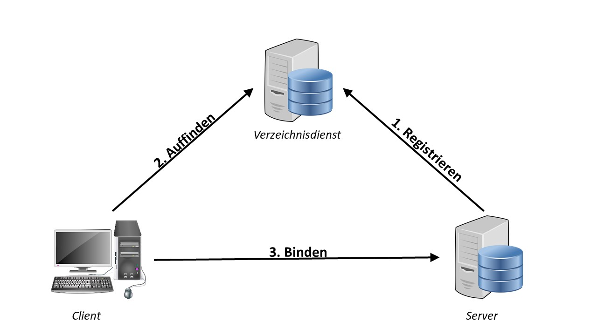
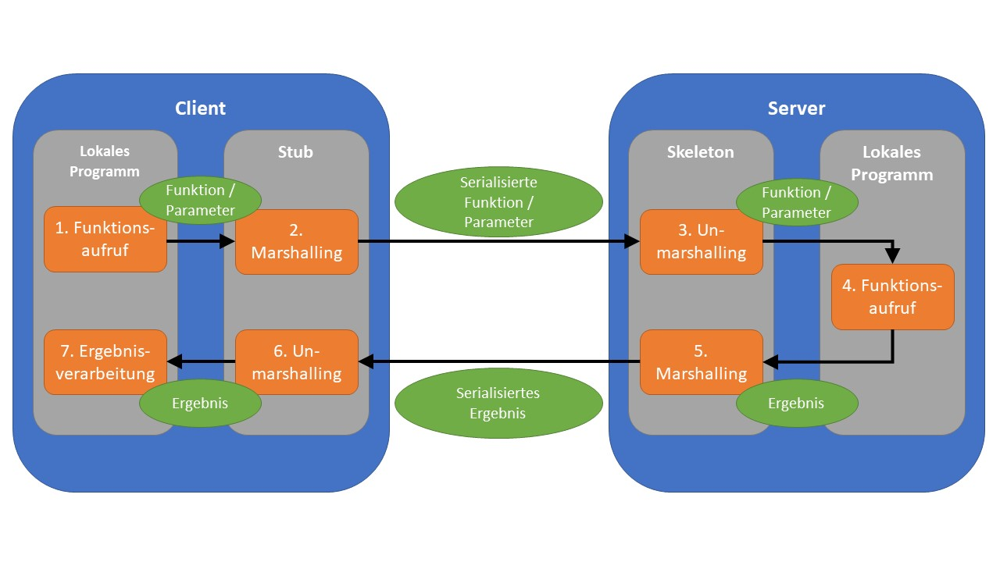

# RPC

RPC \(Remote Procedure Call\) ist eine Basistechnik zur Kommunikation innerhalb von heterogenen Anwendungslandschaften. Grundgedanke von RPC ist es, Teile eines Kontrollflusses an externe Rechenknoten mit anderen Adressräumen auszulagern \(vgl. Schill 2012, S.46\). Das Prinzip wurde 1976 veröffentlicht und befindet sich seit 1988 im RFC-Standard. Im gleichen Jahr erfolgte die erstmalige Implementierung von RPC durch das ONC RPC \(Open Network Computing RPC\), welches von Sun Microsystems entwickelt wurde.

## Ablauf

Der Ablauf eines entfernten Methodenaufrufs gliedert sich in zwei verschiedene Abschnitte. Bevor der Client einen externen Server mit der Abarbeitung seines Kontrollflusses beauftragen kann, ist ein passender Service zu finden. Der Bindevorgang sowie der nachgelagerte Methodenaufruf werden im Folgenden nach \(Schill 2012, S.47-51\) beschrieben.

### Bindevorgang

In komplexen Netzwerken hat ein Client typischerweise keine Kenntnis von der Gesamtheit der erreichbaren Serverknoten. Es liegen ihm dementsprechend keine Informationen darüber vor, welche Services von Servern angeboten werden bzw. mit welcher Syntax und Semantik die Aufrufe geschehen. Abhilfe könnte die feste Kodierung der Adressen bzw. Dienste innerhalb des Clients schaffen, sei in diesem Fall aber aufgrund der Weitläufigkeit des Netzwerks nicht praktikabel möglich. Auch der Aufwand für das Senden von Broadcasting-Anfragen zwecks Erkundung der Umgebung übersteigt in vielen Fällen das Machbare. Abhilfe schafft hingegen eine Instanz, die zwischen Client- und Serverknoten vermittelt \(siehe Abbildung 1\). Ein sogenannter Verzeichnisdienst wird initial von jedem Server kontaktiert, der das Netzwerk betritt. Der Server übergibt diverse Informationen bezüglich seiner eigenen Beschaffenheit, wie seine Adresse, Schnittstelle und ggf. weitere Beschreibungen. Die Schnittstelle definiert hierbei, welche Methoden von ihm bereitgestellt werden und wie diese aufzurufen sind. Typischerweise wird für ihre einheitliche Beschreibung eine spezielle Schnittstellenbeschreibungssprache verwendet. Nachdem der Verzeichnisdienst die Daten veröffentlicht hat, kann ein Zugriff seitens des Clients erfolgen. Nach erfolgreicher Suche besitzt dieser nun alle Informationen, um sich an einen bestimmten Dienst zu binden.Abbildung 1: Bindevorgang mithilfe von Verzeichnisdienst

### Methodenaufruf

Nachdem ein Client Kenntnis von einem Dienst hat, kann er einen entfernten Methodenaufruf auf diesem durchführen. Initial ruft der Client die benötigte Methode auf seinem lokalen System auf \(siehe Abbildung 2\). Dieser Aufruf wird nun an einen sogenannten **Stub** weitergeleitet, welcher ebenfalls auf dem Client befindlich ist. Ein Stub wird mithilfe der Schnittstellenbeschreibung des Servers erstellt und umfasst alle darin deklarierten Methoden. Das lokale Programm hat keine Kenntnis vom entfernten Server, sondern ausschließlich vom Stub. Dieser kann somit als ein clientseitiger Stellvertreter für die Serverfunktion angesehen werden. Der aufgerufene Stub wandelt nun alle an den Server zu übermittelnden Daten in ein für die Netzwerkübertragung geeignetes Format um, was als **Marshalling** bezeichnet wird. Hierunter befinden sich Angaben über die aufzurufende Methode sowie ggf. Methodenparameter. Anschließend erfolgt eine Übermittlung an den Server. Auf diesem befindet sich nun wiederum ein Stellvertreter, welcher **Skeleton** genannt wird. Dieser repräsentiert das aufrufende Objekt innerhalb des Servers. Nach dem Deserialisieren \(**Unmarshalling**\) der empfangenden Daten, ruft der Skeleton die definierte Funktion des lokalen Server-Programms auf. Das berechnete Ergebnis wird nun auf umgekehrtem Weg wieder an das lokale Programm des Clients übermittelt, wo die Prozessausführung fortzusetzen ist.Abbildung 2: Schematische RPC-Kommunikation

Quelle: In Anlehnung an \(Schill 2012, S. 47\)

## Wichtige Punkte:

Wichtige Punkte bezüglich der Verwendung von RPC werden im Folgenden nach \(Schill 2012, S. 51-55\) dargestellt.

**Parameterübergabe**: Client und Server werden in den meisten Fällen verschiedene Rechenknoten sein, weshalb sie auch über verschiedene Adressräume verfügen. Dies kann zu Problemen führen, wenn Funktionen per Call-by-Reference aufgerufen werden. Das referenzierte Objekt liegt lediglich im Speicher des Clients vor, weshalb es für den Server nicht aufzulösen ist. Funktionen sind daher immer per Call-by-Value zu verwenden.

**Prozessverwaltung**: Um eine performantere Kommunikation zu erreichen, werden entfernte Methodenaufrufe innerhalb unabhängiger Prozesse bzw. Threads ausgeführt. Der Clients nutzt Threads, um gleichzeitig mehrere Anfragen an verschiedene Server zu stellen. Serverknoten sind durch eine geeignete Prozessverwaltung hingegen in der Lage, auf die Anfragen von diversen Clients simultan einzugehen, um ihre Wartezeiten zu vermindern.

**Asynchronität**: In dem klassischen RPC-Ansatz verläuft die Kommunikation zwischen Client und Server synchron. Wenn der Client serialisierte Daten verschickt, blockiert er anschließend bis zum Erhalt des Ergebnisses. Insbesondere bei komplexeren Serverberechnungen kann die lange Wartezeit die Performanz des Clients jedoch erheblich einschränken. Eine asynchrone Kommunikation kann hier Abhilfe schaffen. Der Server übermittelt unverzüglich nach jeder Anfrage ein sogenanntes Future bzw. Promise an den Client. Hat der Server seine Berechnung abgeschlossen, wird dieses Objekt auf Clientseite durch das tatsächliche Ergebnis ersetzt. Der Vorteil eines Future bzw. Promise ist, dass für den Client zu jedem Zeitpunkt ersichtlich ist, ob dieses bereits das gewünschte Resultat beinhaltet oder noch als Platzhalter dient. Der Client kann hierdurch seine Programmprozedur nach Aufruf einer entfernten Methode weiterführen und befindet sich nicht in einem blockierenden Zustand.

**Fehlersemantik**: Eine RPC-Kommunikation besitzt drei verschiedene Schwachpunkte. Sowohl der Client als auch der Server sind nicht vor Ausfällen geschützt. Weiterhin kann es zu Nachrichtenverlusten innerhalb des Netzwerks kommen. Diese Ausfallrisiken sind in Tabelle 1 verschieden klassifizierten RPC-Systemen gegenübergestellt. Jedes Paar von Systemklasse und Fehlerart sind zwei Zahlen zugeordnet. Die Ausführungen beschreiben, wie oft die vom Client angeforderte Operation auf dem Server ausgeführt wurde. Das Ergebnis definiert, wie oft der Client ein Resultat vom Server tatsächlich erhalten hat.

|  | Fehlerfreier Ablauf | Nachrichtenverluste | Zus. Ausfall Server | Zus. Ausfall Client |
| :--- | :--- | :--- | :--- | :--- |
| **Maybe** | Ausführung: 1; Ergebnis: 1 | Ausführung: 0/1; Ergebnis: 0/1 | Ausführung: 0/1; Ergebnis: 0/1 | Ausführung: 0/1; Ergebnis: 0/1 |
| **At-Least-Once** | Ausführung: 1; Ergebnis: 1 | Ausführung: &gt;=1; Ergebnis: &gt;=1 | Ausführung: &gt;=0; Ergebnis: &gt;= 0 | Ausführung: &gt;=0; Ergebnis: 0 |
| **At-Most-Once** | Ausführung: 1; Ergebnis: 1 | Ausführung: 1; Ergebnis: 1 | Ausführung: 0/1; Ergebnis: 0/1 | Ausführung: 0/1; Ergebnis: 0 |
| **Exactly-Once** | Ausführung: 1; Ergebnis: 1 | Ausführung: 1; Ergebnis: 1 | Ausführung: 1; Ergebnis: 1 | Ausführung: 1; Ergebnis: 1 |

Tabelle 1: Verhalten von RPC-Systemklassen bei verschiedenen Fehlerarten

Quelle: In Anlehnung an \(Schill 2012, S. 54\)

Ein System mit der Fehlerklasse **Maybe** vollzieht keine Fehlerbetrachtung. Eine Anfrage wird einmalig versendet, unabhängig davon, ob der Client ein Resultat erhält oder nicht. Ein System mit der Fehlerklasse **At-Least-Once** reagiert auf ausbleibende Antworten seitens des Servers, indem der Client weitere Anfragen derselben Art stellt, bis schließlich eine Antwort erhalten wurde. Wurden Antworten aber beispielsweise lediglich aufgrund eines überlasteten Netzwerks noch nicht zugestellt, aber dennoch vom Server bearbeitet, kann die wiederholte Anfrage für ungewollte Seiteneffekte sorgen. Dieses Problem vermeiden Systeme mit der Fehlerklasse **At-Most-Once**. Aufrufwiederholungen werden hier vom Server explizit erkannt und nicht behandelt. Die stärkste Klasse wird als **Exactly-Once** bezeichnet. Bei einem Server- bzw. Client-Ausfall werden beide Systeme auf den Zustand gebracht, der vor der Anfrage herrschte. Die Anfrage wird anschließend erneut durchgeführt. Somit ist die Konsistenz der Systeme zueinander gewährleistet.

## gRPC

gRPC ist ein öffentlich zugängliches RPC-Framework, das 2015 von Google veröffentlicht wurde. Mithilfe von gRPC ist möglich,  verschiedensprachige Microservices bzw. Endgeräte miteinander zu verknüpfen sowie Client-Bibliotheken zu erstellen. \(Google 2017\)

### Protocol Buffers

Ein zentrales Element von gRPC sind die sogenannten Protocol Buffers, welche ebenfalls von Google entwickelt wurden. Ein Protocol Buffer ist vergleichbar mit einem XML-Dokument. Hierin können Datenobjekte mitsamt ihren Attributen einheitlich dargestellt werden. Gegenüber anderen Dateiformaten bieten sie jedoch diverse Vorteile. Sie haben beispielsweise weniger Overhead als beispielsweise XML oder JSON-Dateien. Weiterhin fällt das Parsen von Protocol Buffers deutlich weniger zeitintensiv aus. Als Nachteil ist aufzuführen, dass sie in ihrer Rohform nicht von Menschen lesbar sind.

Um einen Protocol Buffer zu erstellen, müssen initial Message Types und Services angelegt werden (siehe Code-Beispiel 1). Diese werden innerhalb einer JSON-artigen Proto-Datei zusammengefügt und bilden in ihrer Gesamtheit die spätere Schnittstelle des gRPC-Systems. EIn Message Type definiert einen Datentyp, während ein Service eine Menge spezieller Funktion beinhaltet. Innerhalb eines Message Types werden alle Datenfelder zusätzlich ihrer Datentypen aufgeführt. Es wird zwischen skalaren Datentypen, wie beispielsweise String oder Integer, und nicht-skalaren Datentypen in der Form von weiteren Message Types unterschieden. Ein Message Type kann so beispielsweise aus anderen Message Types aufgebaut sein. Jedes Datenfeld ist weiterhin mit einem numerischen und einzigartigen Tag zu erweitern, der für die interne Verarbeitung benötigt wird. Mithilfe der Schlüsselwörter required, optional und repeated kann spezifiziert werden, ob und wie oft ein Attribut angegeben werden muss bzw. darf.

Ein Service beschreibt hingegen abstrakt, welche Methoden das Interface anbietet bzw. welche Parameter diese erwarten und zurückliefern. Dabei kann er bereits Bezug auf die definierten Message Types nehmen.

```
// Proto-Datei

service Greeter {
  // Berechne Preis von speziellem Auto
  rpc CalculatePrice (Auto) returns (int32) {}
}

// Datentyp Auto
message Auto {
  required Hersteller hersteller = 1;
  required int32 id = 2;
  optional string modell = 3;
  optional AntriebType type = 4 [default = VORDERRAD];
}

  enum AntriebType {
    ALLRAD = 0;
    VORDERRAD = 1;
    HINTERRAD = 2;
  }

  message Hersteller {
    required string number = 1;
    optional string standort = 2;
  }
```
Code-Beispiel 1: Protocol Buffer

Nachdem die Proto-Datei erstellt wurde, ist diese zu kompilieren. Anschließend erhält man einen nicht mehr lesbaren Protocol Buffer.

### Verwendung

MIthilfe des Protocol Buffers generiert gRPC nun automatisch Quellcode. Es werden Getter- und Setter-Methoden für die Message Types erstellt sowie Funktionen zum \(De-\)Serialisieren. Weiterhin liegen nach Kompilierung Stub- sowie Skeleton-Objekte für Client und Server vor. Die Server-Entwickler können sich hierdurch maßgeblich auf die Geschäftslogik konzentrieren, anstatt auf Implementierungsdetails von RPC. Ein weiterer Vorteil von gRPC besteht darin, dass Services und Message Types generell sprachunabhängig sind und sich somit für verschiedene Systeme nicht unterscheiden. Lediglich die Art der Kompilierung gibt vor,  in welcher Sprache die Methoden und Objekte erstellt werden. Hierdurch ist es ohne Aufwand möglich, zwischen hetereogenen Systemen zu kommunizieren. Bisher liegen Bibliotheken für zehn verschiedene Programmiersprachen vor. Weiterhin ermöglicht gRPC die einfache Anbindung von vorgefertigten Modulen bezüglich Authorisierung, Lastenverteilung und Health Checking.

