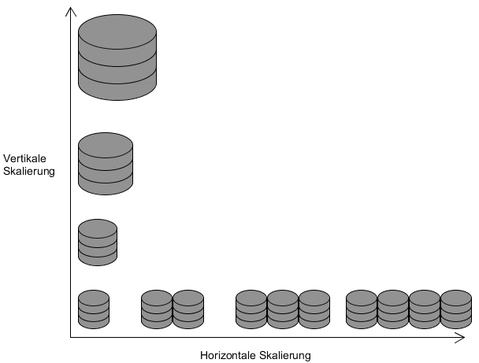

# Einführung

* CAP-Theorem/BASE/ACID
* Skalierung
	* Vertikal
	* Horizontal
* Replication
* Sharding
* Clustering
* Hashing
* Map-Reduce
* In Memory Datenbanken

## ACID/BASE/CAP-Theorem
## Skalierung [2-7]
Unter Skalieren versteht man die Eigenschaft eines Systems, sich an verändernde (meist wachsende) Ansprüche anzupassen. Im Bereich der Datenbanken kann beispielsweise der verfügbare Speicherplatz oder die Zugriffsgeschwindigkeit auf Daten eine Rolle spielen. Eine Verbesserung eines Systems kann dabei auf zwei verschiedene Arten erfolgen:  

* Vertikale Skalierung (Scale-Up)  
Von einer vertikalen Skalierung spricht man, wenn das vorhandene System durch bessere Hardware/Komponenten aufgerüstet wird. Dies kann beispielsweise durch Hinzufügen einer CPU oder das Austauschen der alten durch eine neue erfolgen, um die Leistung des Systems zu erhöhen. Vergrößerung des Speicherplatz kann durch Hinzufügen einer weiteren Festplatte erfolgen.
* Horizontale Skalierung (Scale-out)  
Von horizontaler Skalierung ist die Rede, wenn das vorhandene System durch Hinzufügen neuer Ressourcen Einheiten (Rechner/Server) erweitert wird. 

  

In der Abbildung ist das Prinzip der vertikalen und horizontalen Skalierung anhand des Beispiels eines Datenbanksystems dargestellt. Zu Beginn existiert ein Server, bei der vertikalen Skalierung wird dieser durch bessere Komponenten aufgerüstet, bei der horizontalen Skalierung werden weitere Server hinzugefügt.  
Der Nachteil bei einer vertikalen Skalierung besteht darin, dass sie irgendwann an ihre Grenzen stößt. Wenn bereits die besten Komponenten, die auf dem Markt zu finden sind, verwendet werden, kann keine Verbesserung mehr erfolgen. Der Vorteil ist jedoch, dass meist keine Änderungen beispielsweise an der Anwendungssoftware durchgeführt werden müssen, da die Struktur des Systems gleich bleibt. Bei horizontaler Skalierung können Änderungen jedoch von Nöten sein, wenn Software stark an die bisherige Struktur angepasst ist. Viele NoSQL-Datenbanken haben dieses Problem jedoch nicht, da sie auf diese Art der Skalierung ausgelegt sind und Mechanismen dafür bieten.
## Replication
## Sharding
## Clustering
## Hashing
## Map-Reduce
## In Memory Datenbanken