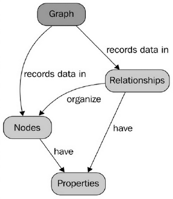

# Graphen Datenbanken (vgl. [1 Kap. 1.4,2.4,7.6],[2 Kap. 6],[12 Kap. 3],[13 Kap. 3],[72,89-96])
Graphen Datenbanken eignen sich dafür, Objekte und ihre komplexen Beziehungen untereinander zu speichern und zu verwalten. Die Daten werden dabei als Graphen gespeichert, Objekte werden als Knoten realisiert, Beziehungen über Kanten dargestellt. Sie eignen sich daher besonders gut für Daten mit sehr vielen Beziehungen und bei Graphen theoretischen Problemen. Anwendungsfälle sind beispielsweise Soziale Netzwerke, Empfehlungssysteme und Geoinformationssysteme.

## Funktionsweise
Die meisten Graphen Datenbanken speichern ihre Daten in einem Property-Graphen. Dies ist ein Graph, der zusätzlich zu Knoten und Kanten (Beziehungen) auch beliebige Eigenschaften zu diesen Elementen speichern kann. Knoten und Beziehungen können somit durch Attribute weiter spezifiziert werden. Die nachfolgende Abbildung stellt grafisch dar, wie eine Graphen Datenbank aufgebaut ist [13].   

  [13]  

Eine weitere wichtige Eigenschaft ist, dass es zwischen zwei Knoten auch mehrere Kanten geben kann. So lassen sich auch mehrere komplexe Verbindungen zwischen beliebigen Objekten, bzw. Knoten darstellen.  
Die Funktionsweise von Graphen Datenbanken basiert dabei auf den mathematischen Eigenschaften der Graphentheorie.

## Vorteile
Der größte Vorteil dieser Datenbanken besteht in ihrem speziellen Einsatzgebiet: Alles was sich als Graph abbilden lässt, kann mit deutlich besserer Performance in Graphen Datenbanken gespeichert und verwaltet werden, als in anderen Datenbanken. Alle Probleme die auf der Graphentheorie basieren, lassen sich leicht lösen, beispielsweise die Suche nach den kürzesten Wegen. Während bei relationalen Datenbanken dafür komplexe Joins verwendet werden müssen, können in Graphen Datenbanken durch einfaches Traversieren zwischen den Knoten diese Probleme schnell und einfach gelöst werden. Graphen Datenbanken eignen sich daher am besten für Datensätze, die sehr viele Beziehungen untereinander haben. 

## Nachteile
Ihre Spezialisierung auf Graphen ist allerdings auch ihr größter Nachteil. Sie eignen sich nicht dafür große Datensätze mit keinen oder wenigen Beziehungen untereinander zu verwalten, relationale Datenbanken können mit diesen Daten meist schneller und effizienter umgehen. Des Weiteren existieren noch keine standardisierte Abfragesprache, jeder Anbieter hat hier meist eigene Lösungen, was es nicht einfach macht, einen Anbieter zu wechseln.

## Anbieter [97]
Die am häufigsten genutzten Graphen Datenbanken laut db-engines.com (Stand Juli 2017)

* Neo4j: 38,52 Punkte
* Microsoft Azure Cosmos DB: 7,71 Punkte
* OrientDB: 5,57 Punkte