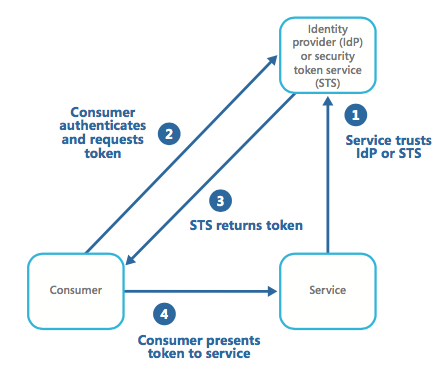

# Federated Identity Pattern
Durch die Verwendung dieses Patterns, kann die Entwicklung sowie die Administrierung von Anwendungen vereinfacht werden, indem die Authentifizierung an einen externen Anbieter weitergereicht wird.

## Problematik
Anwender müssen im Alltag mit vielen verschiedenen Anwendungen arbeiten, für welche sie unterschiedliche Anmeldeinformationen haben. Dies führt zu negativen Erfahrungen für die Anwender, da sie sich viele Passwörter merken müssen. Des Weiteren ist es für die Administratoren ein sehr hoher Aufwand alle Anmeldeinformationen zu verwalten. Neben dem Punkt des hohen Verwaltungsaufwands, führt es auch zu einem Sicherheitsrisiko falls ein Mitarbeiter die Firma verlässt, müssen viele einzelne Anmeldeinformationen gelöscht werden.

## Lösung
Um der vorangegangenen Problematik entgegenzuwirken, sollte eine Authentifizierungsfunktion implementiert werden, welche Federated Identity's unterstützt. Das bedeutet, dass die Authentifizierungsfunktion vom Anwendungscode getrennt wird und die Authentifizierung an einen Identity Provider (IdP) wie z.B. Microsoft, Google, Yahoo! oder Facebook weitergereicht wird.  
Dies vereinfacht die Entwicklung sowie die Verwaltung der Nutzerdaten. Außerdem hat der Benutzer dadurch die Möglichkeit, sich neben der Standard Authentifizierung über einen frei wählbaren IdP zu authentifizieren. Dadurch muss sich der Anwender keine neuen Anmeldeinformationen merken.
Des Weiteren wird durch die Verwendung eines IdP die Authentifizierung von der Autorisierung entkoppelt.  
Abbildung 1 veranschaulicht die Funktionsweise des Federated Identity Pattern, wenn eine Anwendung auf einen Dienst zugreifen muss, der eine Authentifizierung mittels eines IdP erfordert.

  
    
   (Abbildung 1: Übersicht über eine Authentifizierung)

## Berücksichtigungen
Wenn man dieses Pattern verwendet, sollte man verschiedene Aspekte beachten:
* Wenn die Anwendung auf mehrere Rechenzentren verteilt werden soll, muss der Identitätsmanagement Mechanismus in den Rechenzentren ebenfalls bereitstehen, um die Zuverlässigkeit und Verfügbarkeit der Anwendung zu gewährleisten.
* Wenn man einen Identity Provider bereitstellt muss beachtet werden, dass in der Regel keine Informationen über den authentifizierten Benutzer außer einer E-Mail-Adresse und einem Namen zur Verfügung stehen.
* Wenn mehr als ein Identity Provider für die Anwendung bereitsteht muss erkannt werden, zu welchem Identity Provider der Anwender weitergeleitet werden muss.

## Anwendungsfälle
Dieses Pattern wird sehr häufig in SaaS (Software as a Service) Anwendung verwendet, um den Nutzern neben der Standard Anmeldung, eine Anmeldung über ihre Accounts für die Sozialen Netzwerke bereitzustellen.  
Weitere Anwendungsfälle sind Enterprise Anwendungen, Business-to-Business Anwendungen, Anwendungen welche mit dritt Anbieter Software interagieren sowie Unternehmen, die ihre IT-Systeme zusammengefasst haben.

