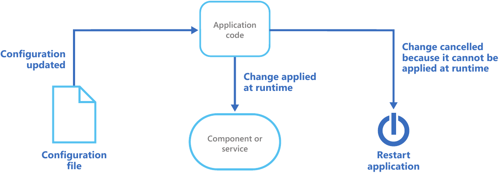

# Runtime Reconfiguration Pattern
Das Runtime Reconfiguration Pattern soll eine Rekonfiguration einer Applikation während der Laufzeit ermöglichen, so dass der Nutzer oder Kunde nur eine minimale Downtime oder daraus resultierende Unterbrechung der Applikation erfährt.

Dieses Pattern ist erstmal abhängig von den Featuren des Hosts der Applikation. Diese könnten aus dem Hochladen einer Konfigurationsdatei oder dem Zugriff über ein Administrationsportal oder einer API bestehen.
Der Applikationscode kann dabei die Änderung an der Konfiguration untersuchen und sie auf die dazu gehörigen Komponenten der Applikation anwenden. Die Komponenten müssen dabei die Änderung erkennen und sie übernehmen.
Wenn die Komponenten das nicht während der Laufzeit können, ist ein Neustart der Applikation dafür notwendig. Dies kann dadurch geschehen, dass der Host eine Änderung erkennt und der Applikation mitteilt sich neu zu starten oder es muss ein Code implementiert werden, der Änderungen an der Einstellung erkennt und gegebenfalls die Applikation zum Neustarten zwingt.

Abbildung 1 - Schema eines Runtime Reconfiguration Patterns

Viele Umgebungen arbeiten mit Events als Antwort auf eine Konfigurationsänderung. Die Umgebungen, die es nicht tun, erfordern ein zyklisches Absuchen nach Änderungen der Konfiguration und eine  Anwedung dessen falls notwendig. Es kann dabei auch nötig sein, das Datum und die Zeit einer Konfigurationsdatei zu vergleichen, um eine eventuelle neue Version festzustellen.
Alternativ kann die Umgebung auf bestimmte Änderungen reagieren. Zum Beispiel könnte beim Auftreten eines Runtime-Error ein automatisches Sammeln von zusätzlichen Informationen erfolgen.

Folgende Punkte sollte man beim Implementieren dieses Patterns beachten:
<ul>
<li>Die Konfigurationsdateien sollten abgetrennt von einer entwickelten Applikation gespeichert werden.</li>
<li>Wenn Konfigurationsänderungen nicht automatisch erkannt werden, sollte man einen alternativen Mechanismus zum Erkennen und Anwenden von Änderungen erstellen.</li>
<li>Wenn das zyklische Absuchen nach Änderungen erforderlich ist, sollte man abwägen in welchen Abständen man dies tut.</li>
<li>Wenn es mehr als eine Instanz der Anwendung gibt, sollte man beachten, dass die Änderung an alle Instanzen der Anwendung nach einer gewissen Zeit kommuniziert wird.</li>
<li>Wenn eine Konfigurationsänderung einen Neustart des Hostsystem erfordert, sollte man die Art der Änderung identifizieren. Es könnte eine Änderung sein, die einen automatischen Neustart des Systems erfordert oder eine, die die Verantwortung dem Administrator zuschiebt, um die Applikation je nach Zeit oder Peformanz des Systems neu zu starten.</li>
<li>Es ist abzuwägen wie man die Konfiguration zurücksetzen will, für den Fall, dass die Änderung Fehler verursacht hat.</li>
<li>Auch die Herkunft der Konfigurationseintstellung sollte beachtet werden, weil es die Performanz der Applikation beeinflussen könnte. Zum Beispiel ein Fehler, der aufgetreten ist, wenn ein externer Speicher nicht verfügbar ist.</li>
<li>Das Cachen kann dabei helfen Verzögerungen zu reduzieren, wenn Komponenten wiederholt auf Konfigurationen zugreifen müssen.
</ul>

Dieses Pattern ist hilfreich für:
<ul>
<li>Applikationen, welche unnötige Downtimes vermeiden müssen.</li>
<li>Umgebungen, die automatisch Events auslösen, wenn die Hauptkonfiguration sich geändert hat.</li>
<li>Applikationen bei denen sich die Konfigurationen oft ändern und die Änderung nicht den Neustart der Applikation benötigen sollte.
</ul>
Nicht hilfreich wäre es für Laufzeitkomponenten, die so aufgebaut sind, dass sie die Konfiguration nur in ihrer Startzeit laden und der Aufwand diese Komponenten anzupassen im Vergleich zum Neustarten und einer kurzen Downtime nicht gerechtfertigt ist.
